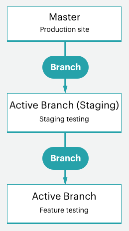

# Projekt-Workflow starten

Die Adobe Commerce in Cloud-Infrastrukturen enthalten ein einzelnes Git-Repository mit einer `master` Verzweigung für die Produktionsumgebung, die zur Erstellung einer Staging- und mehrerer Integrationsumgebungen für Test- und Entwicklungsarbeiten verzweigt werden kann. Sie können bis zu vier aktive Umgebungen haben, darunter eine `master` für Ihren Produktions-Server. Siehe [Starter-Architektur](starter-architecture.md) für einen Überblick.

Befolgen Sie für Ihre Umgebungen den [!UICONTROL Development > Staging > Production]-Workflow zum Entwickeln und Bereitstellen Ihrer Site.

- **Produktionsumgebung (Live-Site)** Bietet eine vollständige Produktionsumgebung mit allen Services, die aus dem Code in der `master` erstellt und bereitgestellt werden.
- **Staging-**: Bietet eine vollständige Staging-Umgebung, die der Produktionsumgebung alle Services zuordnet, die aus einer `staging` Verzweigung erstellt und bereitgestellt werden, die Sie durch Klonen aus `master` erstellen.
- **Integrationsumgebungen**: Bietet bis zu zwei aktive Entwicklungsumgebungen, die Sie aus der `staging`-Verzweigung erstellen. Die `integration`-Umgebung unterstützt keine Drittanbieterdienste wie Fastly und New Relic.

Für Ihre Niederlassungen können Sie jede beliebige Entwicklungsmethode verwenden. Sie können beispielsweise einer Agile-Methode wie Scrum folgen, um für jeden Sprint Verzweigungen zu erstellen.

Von jedem Sprint aus können Sie Verzweigungen für jede Benutzergeschichte erstellen. Alle Geschichten werden überprüfbar. Sie können die Verzweigung kontinuierlich mit der Sprint-Verzweigung zusammenführen und diese Verzweigung kontinuierlich überprüfen. Wenn der Sprint beendet wird, können Sie die Sprint-Verzweigung mit `master` zusammenführen, um alle Sprint-Änderungen in der Produktion bereitzustellen, ohne einen Test-Engpass zu bewältigen.

## Entwicklungs-Workflow

Die Entwicklung und Bereitstellung auf Starter-Plänen beginnen mit Ihrem ersten Projekt. Sie erstellen Ihr Projekt mit der „leeren Site“, einem Vorlagencode-Repository für Adobe Commerce in Cloud-Infrastrukturen mit einem vollständig vorbereiteten Store. Dadurch wird eine `master` Verzweigung mit einer Kopie des Codes aus Ihrer Produktionsumgebung erstellt.

Der Entwicklungs-Workflow umfasst Folgendes:

- [Klonen und Verzweigen](#clone-and-branch) aus dem `master`, um `staging`- und Entwicklungszweige zu erstellen
- [Entwickeln von Code](#develop-code) und Installieren von Erweiterungen lokal in einer Entwicklungsverzweigung, einschließlich [!DNL Composer]
- [Konfigurieren](#configure-store) Ihrer Store- und Erweiterungseinstellungen
- [Konfiguration generieren](#generate-configuration-management-files) Verwaltungsdateien
- [Pushen von Code](#push-code-and-test) und Konfiguration zum Erstellen und Bereitstellen in der `staging`- und `production`


Sie haben auch einige optionale Schritte, mit denen Sie Ihren Code entwickeln und testen und Ihre Daten speichern können:

- [Installieren von Beispieldaten](#optional-install-sample-data) in Ihrem Store
- [Abrufen von Produktionsspeicherdaten](#optional-pull-production-data) bis zu Umgebungen

Bei diesem Prozess wird davon ausgegangen, dass Sie Ihren [lokalen Entwicklerarbeitsbereich“ eingerichtet &#x200B;](../development/overview.md).

### Klonen und Verzweigen

Für ein neues Starterplanprojekt wurde eine `master` Verzweigung aus dem Git-Repository der Adobe Commerce in der Cloud-Infrastruktur geklont. Um mit der Verzweigung und der Arbeit mit Code zu beginnen, klonen Sie die `master` Verzweigung in Ihre lokale Umgebung.

Das Format des Git-Klonbefehls ist:

```bash
git fetch origin
```

```bash
git pull origin <environment-ID>
```

Wenn Sie das erste Mal mit der Arbeit in Verzweigungen für Ihr Starterprojekt beginnen, erstellen Sie eine `staging` Verzweigung. Dadurch wird eine Code-Verzweigung erstellt, die mit der `master`-Verzweigung übereinstimmt, die in einer Staging-Umgebung bereitgestellt wird, um Konfigurations- und Code-Änderungen zu testen, bevor sie in der Produktionsumgebung bereitgestellt wird.

Als Nächstes erstellen Sie Verzweigungen aus `staging`, um Code zu entwickeln, Erweiterungen hinzuzufügen und Integrationen von Drittanbietern zu konfigurieren. Jedes Mal, wenn Sie benutzerdefinierten Code entwickeln, Erweiterungen hinzufügen, einen Service eines Drittanbieters integrieren, in einer Entwicklungsverzweigung arbeiten, die aus der `staging` erstellt wurde. Es stehen vier aktive Integrationsumgebungen zur Verfügung. Wenn Sie eine aktive Verzweigung per Push übertragen, wird der Code in einer dieser Integrationsumgebungen automatisch zum Testen bereitgestellt.

Das Format des Git-Verzweigungsbefehls ist:

```bash
git checkout <branch-name>
```

Das Format des `branch`-Befehls der Cloud-CLI ist:

```bash
magento-cloud environment:branch <environment-name> <parent-environment-ID>
```



### Entwickeln von Code

Durch Verwendung der Adobe Commerce-Basisverzweigung auf Cloud-Infrastruktur-Code können Sie mit der Installation von Erweiterungen, der Entwicklung von benutzerdefiniertem Code, dem Hinzufügen von Designs und vielem mehr beginnen.

Verwenden Sie bei Ihrer Entwicklungsarbeit eine Verzweigungsstrategie. Wenn Sie alle Aufgaben auf einmal in einer Verzweigung ausführen, kann dies das Testen erschweren. Sie können beispielsweise die kontinuierliche Integration und Sprint-Methoden verwenden, um zu funktionieren:

- Fügen Sie einige Erweiterungen hinzu und konfigurieren Sie sie für Ihre erste Verzweigung
- Diesen Code per Push übertragen, testen und dann in die Staging- und Produktionsumgebung übertragen
- Services in `services.yaml` vollständig konfigurieren und ein Design hinzufügen
- Diesen Code per Push übertragen, testen und dann in die Staging- und Produktionsumgebung übertragen
- Integration mit einem Service von Drittanbietern
- Diesen Code per Push übertragen, testen und dann in die Staging- und Produktionsumgebung übertragen

Bis Sie Ihren Store vollständig erstellt, konfiguriert und startbereit haben. Aber lesen Sie weiter, es gibt viele Optionen für Ihre Store- und Code-Konfiguration.

>[!NOTE]
>
>Schließen Sie noch keine Konfigurationen auf Ihrer lokalen Workstation ab.


### Store konfigurieren

Wenn Sie bereit sind, Ihren Store zu konfigurieren, pushen Sie den gesamten Code in die `integration`. Konfigurieren Sie Ihre Store-Einstellungen über den Administrator für die Integrationsumgebung, nicht in Ihrer lokalen Umgebung. Sie finden die URL, indem Sie auf **Site zugreifen** im [!DNL Cloud Console] klicken

Die besten Informationen zu Konfigurationen finden Sie in der Dokumentation zu Adobe Commerce und den installierten Erweiterungen. Im Folgenden finden Sie einige Links und Ideen, die Ihnen bei den ersten Schritten helfen:

- [Best Practices für die Store-](../store/best-practices.md) für bestimmte Best Practices in der Cloud
- [Standardkonfiguration](https://experienceleague.adobe.com/de/docs/commerce-admin/start/setup/store-details) für Store-Administratorzugriff, Namen, Sprachen, Währungen, Branding, Sites, Store-Ansichten und mehr
- [Design](https://experienceleague.adobe.com/de/docs/commerce-admin/content-design/content-menu#design-features) für Ihr Aussehen der Site und Stores, einschließlich CSS und Layouts
- [Systemkonfiguration](https://experienceleague.adobe.com/de/docs/commerce-admin/systems/guide-overview) für Rollen, Tools, Benachrichtigungen und Ihren Verschlüsselungsschlüssel für Ihre Datenbank
- Erweiterungseinstellungen anhand ihrer Dokumentation

Über die Store-Einstellungen hinaus können Sie mehrere Sites und Stores, konfigurierte Services und mehr weiter konfigurieren. Siehe [Store konfigurieren](../store/overview.md).

### Erstellen von Konfigurationsverwaltungsdateien

Wenn Sie mit Adobe Commerce vertraut sind, sollten Sie sich Gedanken darüber machen, wie Sie Ihre Konfigurationseinstellungen aus Ihrer Datenbank in der Entwicklungsumgebung in die Staging- und Produktionsumgebungen übertragen können. Zuvor mussten Sie alle Konfigurationseinstellungen auf Papier oder in eine Datei kopieren und dann manuell auf andere Umgebungen anwenden. Oder Sie haben Ihre Datenbank gelöscht und diese Daten in eine andere Umgebung verschoben.

Adobe Commerce in Cloud-Infrastrukturen bietet einen Satz von zwei [Konfigurationsverwaltung](../store/store-settings.md)-Befehlen, die Konfigurationseinstellungen aus Ihrer Umgebung in eine -Datei exportieren. Diese Befehle sind nur für **Adobe Commerce in Cloud Infrastructure 2.2 und höher verfügbar**.

- `php .vendor/bin/ece-tools config:dump` - Exportiert nur die von Ihnen eingegebenen oder geänderten Konfigurationseinstellungen aus den Standardwerten in eine Konfigurationsdatei. _Empfohlen_.
- `php bin/magento app:config:dump` - Exportiert alle Konfigurationseinstellungen, einschließlich „Geändert“ und „Standard“, in eine Konfigurationsdatei.

Die generierte Datei wird `app/etc/config.php`.

Erzeugen Sie die Datei in der Integrationsumgebung, in der Sie Adobe Commerce konfiguriert haben. Führen Sie den Prozess zum Generieren der Datei, Hinzufügen zur Verzweigung und Bereitstellen durch.

**Wichtige** zur Konfigurationsverwaltung:

- Alle Konfigurationseinstellungen, die in der über den `app:config:dump`-Befehl generierten Datei enthalten sind, sind in der bereitgestellten Umgebung für die Bearbeitung gesperrt oder schreibgeschützt. Dies ist einer der Gründe, warum Adobe die Verwendung des Befehls `.vendor/bin/ece-tools config:dump` empfiehlt.

  Beispielsweise installieren Sie ein Modul für Fastly in Ihrer Entwicklungsumgebung. Dieses Modul kann nur in der Staging- und Produktionsumgebung konfiguriert werden. Durch die Verwendung des Befehls `.vendor/bin/ece-tools config:dump` können diese Standardfelder bearbeitet werden, wenn Sie Ihre Entwicklungsänderungen in der Staging- und Produktionsumgebung bereitstellen.

- Die generierte Datei kann je nach Größe Ihrer Bereitstellung lang sein. Der Befehl `.vendor/bin/ece-tools config:dump` generiert eine kleinere Datei als die mit dem Befehl `app:config:dump` generierte Datei.

Wenn Sie Adobe Commerce Version 2.2 oder höher verwenden, bieten die Konfigurationsverwaltungsbefehle eine zusätzliche Funktion zum Schutz sensibler Daten, z. B. Sandbox-Anmeldeinformationen für ein PayPal-Modul. Während des Exportvorgangs werden alle Werte, die vertrauliche Daten enthalten, in eine separate Konfigurationsdatei exportiert, `env.php` im `app/etc/`. Diese Datei verbleibt in Ihrer lokalen Umgebung und wird nicht kopiert, wenn Sie Ihren Code in eine andere Verzweigung pushen. Sie können Umgebungsvariablen auch mit CLI-Befehlen in allen Adobe Commerce on Cloud Infrastructure-Versionen erstellen.


Siehe [Konfigurationsverwaltung](../store/store-settings.md).

### Push-Code und Test

An dieser Stelle sollte eine entwickelte Code-Verzweigung mit einer Konfigurationsdatei (`config.local.php` oder `config.php`) zum Testen bereit sein.

Jedes Mal, wenn Sie Code aus Ihrer lokalen Umgebung pushen, wird eine Reihe von Build- und Bereitstellungsskripten ausgeführt. Diese Skripte generieren neuen Code und stellen ihn in der Remote-Umgebung bereit. Wenn Sie beispielsweise eine Entwicklungsverzweigung von Ihrer lokalen Umgebung auf die Remote-Verzweigung pushen, aktualisiert eine entsprechende Umgebung Services, Code und statische Inhalte.

Sie können mit einer Store-URL, Admin-URL und SSH direkt auf diese Umgebung zugreifen. Zu diesen Umgebungen gehören ein Webserver, eine Datenbank und konfigurierte Services. Wenn Sie bereit sind, können Sie mit der Bereitstellung und dem Testen in der Staging-Umgebung beginnen.

Weitere Informationen finden Sie unter [Bereitstellungs-Workflow](#deployment-workflow).

### Optional: Installieren von Beispieldaten

Wenn Sie beim Entwickeln Ihres Stores Beispieldaten benötigen, können Sie Beispieldaten installieren. Diese Daten simulieren einen aktiven Speicher, einschließlich Kunden, Produkten und anderer Daten. Diese Beispieldaten funktionieren am besten mit einer Vorlageninstallation von Adobe Commerce auf einer „leeren Site“ in der Cloud-Infrastruktur, wenn Sie Ihr Projekt erstellen. Es empfiehlt sich, die Beispieldaten zu entfernen, bevor sie live geschaltet werden. Siehe [Installieren optionaler Beispieldaten](../test/sample-data.md).


### Optional: Abrufen von Produktionsdaten

Fügen Sie alle Ihre Produkte, Kataloge, Site-Inhalte usw. direkt zur `production` hinzu. Durch Hinzufügen dieser Daten zur Produktionsumgebung können Sie Ihren Kunden aktualisierte Preise, Coupons, Lagerbestände, Verkaufsankündigungen, Informationen über zukünftige Angebote und mehr bereitstellen. Diese Daten enthalten keine Erweiterungskonfigurationen, die Sie in Ihrer lokalen Entwicklungsverzweigung konfigurieren.

Wenn Sie Funktionen entwickeln, Erweiterungen hinzufügen und Designs entwerfen, ist es hilfreich, mit echten Daten zu arbeiten. Sie können jederzeit aus [&#x200B; Produktionsumgebung einen Datenbank-Dump &#x200B;](../storage/database-dump.md) und diesen bei Bedarf in Ihre Staging- und Integrationsumgebungen pushen.

So exportieren Sie Produktionsdaten als Testdaten zur Verwendung in Staging- und Integrationsumgebungen:

- [Ausführen der Support Utilities](https://experienceleague.adobe.com/docs/commerce-operations/configuration-guide/cli/run-support-utilities.html?lang=de) CLI-Befehle (empfohlen) beim Exportieren eines geschützten Backups von Kunden- und Speicherdaten mit Ihrem Adobe Commerce-Verschlüsselungsschlüssel

- [Datenerfassung](https://experienceleague.adobe.com/de/docs/commerce-admin/systems/tools/support#data-collector) Tool zum Generieren und Exportieren von Daten

Informationen zum Migrieren dieser Daten finden Sie unter [Migrieren und Bereitstellen von statischen Dateien und Daten](../deploy/staging-production.md#migrate-static-files).


>[!NOTE]
>
>Bevor Sie die Daten in eine andere Umgebung verschieben, sollten Sie erwägen, Ihre Daten zu bereinigen. Sie haben verschiedene Möglichkeiten, z. B[&#x200B; „Support-Dienstprogramme verwenden](https://experienceleague.adobe.com/docs/commerce-operations/configuration-guide/cli/run-support-utilities.html?lang=de) oder ein Skript zum Bereinigen von Kundendaten entwickeln.

>[!WARNING]
>
>Pushen Sie keine Datenbank aus einer Integrations- oder Staging-Umgebung in eine Produktionsumgebung. Wenn Sie dies tun, überschreiben die Daten aus der Integrations- oder Staging-Umgebung Ihre Live-Produktionsdaten, einschließlich Umsatz, Bestellungen, neue und aktualisierte Kunden und mehr.

## Bereitstellungs-Workflow

Wie in den Architekturinformationen detailliert beschrieben, wird Adobe Commerce in Cloud-Infrastrukturen von Git gesteuert. Die Bereitstellung von Adobe Commerce in der Cloud-Infrastruktur ist Teil Ihrer Git-Push-Prozesse für Verzweigungen.

Wenn Sie verzweigten Code von Ihrer lokalen Umgebung an die Remote-Verzweigung pushen, beginnt eine Reihe von Build- und Bereitstellungsskripten.

Skripte erstellen:

- Die Site wird in der Zielumgebung während eines Builds weiter ausgeführt

- Überprüfen und Ausführen von Adobe Commerce auf Cloud-Infrastruktur-Patches und -Hotfixes

- Kompilieren Sie den Code mit einem Build und stellen Sie das Protokoll bereit

- Überprüfen Sie die Konfigurationsverwaltung, wenn die Bereitstellung statischer Inhalte während dieser Phase erfolgt

- Erstellen oder verwenden Sie einen Slug mit unverändertem Code für einen schnelleren Prozess

- Bereitstellung aller Backend-Services und -Programme

Bereitstellen von Skripten:

- Versetzt die Site in die Zielumgebung in den Wartungsmodus

- Stellt statische Inhalte bereit, wenn diese beim Build nicht abgeschlossen wurden

- Installiert oder aktualisiert Adobe Commerce in der Cloud-Infrastruktur

- Konfigurieren des Routings für Traffic

Wenn Ihr Store vollständig abgeschlossen ist, wird er mit allen aktualisierten Code- und Konfigurationsdateien wieder online geschaltet.

Siehe [Bereitstellungsprozess](../deploy/process.md).

### Push zu Staging und Test

Pushen Sie Ihren Code immer in Iterationen in die `staging` Umgebung, um vollständige Tests durchzuführen. Wenn Sie diese Umgebung zum ersten Mal verwenden, müssen Sie einige Services konfigurieren, darunter [Fastly](/help/cloud-guide/cdn/fastly.md) und [New Relic](../monitor/new-relic-service.md). Konfigurieren Sie außerdem Zahlungs-Gateways, Versand, Benachrichtigungen und andere wichtige Services mit Sandbox- oder Testberechtigungen.

Staging ist eine Vorproduktionsumgebung, die alle Services und Einstellungen so produktionsnah wie möglich bereitstellt. Testen Sie jeden Service gründlich, verifizieren Sie Ihre Leistungstesttools, führen Sie UAT-Tests als Administrator und als Kunde durch, bis Sie das Gefühl haben, dass Ihr Store für die Produktion bereit ist.

Siehe [Bereitstellen Ihres Stores](../deploy/staging-production.md).

### Push zur Produktion

Wenn Sie zur `master` Verzweigung pushen, übertragen Sie sie in die `production`. Schließen Sie die Konfigurations- und Testaktivitäten in der Produktionsumgebung wie in der Staging-Umgebung ab, mit einem wichtigen Unterschied. Verwenden Sie in der Produktionsumgebung Live-Anmeldedaten für die Konfiguration und das Testen. Sobald Sie Ihre Site starten, können Kunden Käufe abschließen und Administratoren können den Live Store verwalten.

Siehe [Bereitstellen Ihres Stores](../deploy/staging-production.md).

### Site-Launch

Es gibt eine klare Anleitung, wie Sie Ihre Site live schalten können. Nachdem Sie diese Schritte abgeschlossen haben, kann Ihr Geschäft Produkte in Ihrem benutzerdefinierten Design sofort zum Verkauf bereitstellen.

Siehe [Site-Launch](../launch/overview.md).

## Kontinuierliche Integration

Nach Ihren Verzweigungs- und Entwicklungsmethoden können Sie einfach neue Funktionen entwickeln, Änderungen konfigurieren und Erweiterungen hinzufügen, um Aktualisierungen kontinuierlich zu entwickeln und bereitzustellen.

Alle Cloud-Infrastrukturumgebungen unterstützen eine kontinuierliche Integration für kontinuierliche Aktualisierungen. Dieser Workflow unterstützt mehrfache Versionen pro Tag oder einen festgelegten Zeitplan entsprechend Ihren Geschäftsanforderungen.

- Erstellen von Entwicklungszweigen mit zukünftigen Funktionen und Änderungen

- Testen des Codes in Ihrer `integration`

- Bereitstellen und Testen in `staging` Umgebung

- Bereitstellen in der `production`
