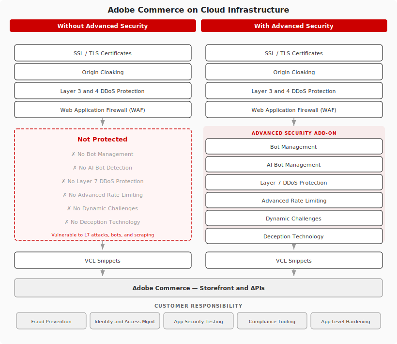

# [!DNL Adobe Commerce Advanced Security]

[!DNL Adobe Commerce Advanced Security] ist ein Produkt, das mit [!DNL Adobe Commerce on Cloud Infrastructure] zusammenarbeitet, um Ihren Online-Store schnell, verfügbar und sicher zu halten. Dies kann dazu beitragen, den Umsatz zu schützen, Ausfallzeiten zu reduzieren und das Vertrauen der Kunden bei Spitzen-Traffic-Ereignissen und automatisierten Angriffen aufrechtzuerhalten.

[!DNL Adobe Commerce on Cloud Infrastructure] umfasst einen integrierten [Layer 3- und 4-DDoS-](./fastly.md#ddos-protection) und eine [Web Application Firewall (WAF)](./fastly-waf-service.md). Unter dem [Modell der gemeinsamen Verantwortung](https://experienceleague.adobe.com/de/docs/commerce-operations/security-and-compliance/shared-responsibility) sind die Erkennung von Layer 7-DDoS, der Bot-Schutz und das proaktive Sperren von IP-Adressen Händlerpflichten, auf die [!DNL Adobe Commerce Advanced Security] eingehen soll.

[!DNL Advanced Security] erweitert den Schutz der Storefront durch Fastly-gestützte Edge-Sicherheitsfunktionen, die Bot-Management, erweiterte Ratenbegrenzung und Layer 7 DDoS-Schutz als Teil einer einheitlichen Edge-Plattform bieten, die Skalierung, Leistung und Sicherheit am Netzwerk-Edge kombiniert.

>[!NOTE]
>
>[!DNL Advanced Security] ist nur für [!DNL Adobe Commerce on Cloud Infrastructure] (PaaS)-Projekte verfügbar.

## Kernfunktionen

[!DNL Adobe Commerce Advanced Security] umfasst die folgenden zusätzlichen Schutzmechanismen:

- **[Bot-Management](https://docs.fastly.com/products/bot-management)** - Identifiziert und reduziert unerwünschte Bot-Aktivitäten in Ihren Web-Anwendungen. Der Bot-Management-Service unterscheidet zwischen legitimen Bots (Crawler-Bots für Suchmaschinen, Social Media-Bots) und bösartigen Bots und bietet Echtzeit-Klassifizierung am Netzwerkrand mit Optionen zum Blockieren, Zulassen, Anfechten oder Beschränken des Traffics.

- **[DDoS Protection](https://docs.fastly.com/products/fastly-ddos-protection)**: Bietet Layer 7 (Application Layer)-DDoS-Schutz über den bestehenden Layer 3- und 4-Schutz hinaus, der in allen [!DNL Adobe Commerce on Cloud Infrastructure]-Projekten enthalten ist. Der DDoS-Schutz-Service absorbiert umfangreiche volumetrische Angriffe und stellt die kontinuierliche Anwendungsverfügbarkeit während verteilter Denial-of-Service (DDoS)-Ereignisse sicher, sodass der Umsatz während Spitzenzeiten des Traffics geschützt ist.

- **[Erweiterte Ratenbegrenzung](https://www.fastly.com/documentation/guides/next-gen-waf/rules/working-with-advanced-rate-limiting-rules/)** - Bietet konfigurierbare Ratenbegrenzungsregeln, die bestimmte URLs, API-Endpunkte und Anwendungsressourcen vor Missbrauch schützen. Der Service zur erweiterten Ratenbegrenzung geht über die [einfache Ratenbegrenzung) hinaus, die über das Fastly CDN-Modul verfügbar &#x200B;](https://github.com/fastly/fastly-magento2/blob/master/Documentation/Guides/RATE-LIMITING.md), um bestimmte Traffic-Muster und Angriffsvektoren anzusprechen und so Infrastrukturbelastungen und Cloud-Kosten zu reduzieren.

>[!NOTE]
>
>[!DNL Advanced Security] Konfigurationen erfordern derzeit die Übermittlung eines Support-Tickets. Die Self-Service-Konfiguration über die Admin-Benutzeroberfläche ist für eine zukünftige Version geplant. Weitere Informationen finden [&#x200B; unter  [!DNL Advanced Security]](#request-advanced-security)Anfrage“.

>[!IMPORTANT]
>
>**Aktuelle Einschränkungen**
>
>Bis zum Ende des 3. Quartals 2026 können Kundinnen und Kunden die Regeln für die Bot-Verwaltung nicht direkt ändern oder verwalten.
>
>Wenn Sie Regeln hinzufügen, ändern oder anpassen möchten, wenden Sie sich über ein -Support[Ticket an den Adobe Commerce-Support](https://experienceleague.adobe.com/home?lang=de&support-tab=home#support). Das Support-Team wird die angeforderten Änderungen implementieren.
>
>Ab dem 4. Quartal 2026 soll Fastly eine Add-on-Funktion veröffentlichen, mit der Kunden Bot-Management-Regeln im Admin-Panel von Commerce verwalten können.

## Standardregeln und -schutz

Die folgenden Standardregeln und Schutzmechanismen sind in [!DNL Advanced Security] verfügbar.

### Layer 7 DDoS

- DDoS-Schwellenwerte sind in die Fastly CDN-Plattform integriert und können derzeit nicht pro Kunde angepasst werden.
- Protokolle für Traffic, der durch DDoS-Schutzmechanismen blockiert wird, sind für Kunden nicht direkt sichtbar.
- Auf Anfrage kann der Adobe Commerce-Support Details zum blockierten DDoS-Traffic bereitstellen.
- In einer zukünftigen Version werden native DDoS-Protokollweiterleitungsfunktionen erwartet.

### Bot-Verwaltung

Die folgenden grundlegenden Schutzmaßnahmen für das Bot-Management sind über das Signal Sciences-Dashboard von Fastly verfügbar.

| Regeltyp | Status | Sichtbarkeit |
|---|---|---|
| Blockieren von Traffic, der als „Verdächtiger Fehler“ markiert ist | Standardmäßig beim Onboarding aktiviert | Sichtbar in New Relic-Protokollen unter `sigsci_tags` |
| Blockieren des Traffics basierend auf einem bestimmten Tag (Sigma-Tag) | Nur konfiguriert, wenn in Zusammenarbeit mit dem Kunden erforderlich | Sichtbar in New Relic-Protokollen unter `sigsci_tags` |
| Ratenbegrenzung für bestimmte APIs oder URL-Muster | Nur konfiguriert, wenn in Zusammenarbeit mit dem Kunden erforderlich | Blockierter Traffic ist in den New Relic-Protokollen unter `Agent_response` sichtbar. |
| Dynamische Herausforderung für bestimmte APIs oder URL-Muster | Nur konfiguriert, wenn in Zusammenarbeit mit dem Kunden erforderlich | Blockierter Traffic ist in den New Relic-Protokollen unter `Agent_response` sichtbar. |
| Browser Challenge | Nur konfiguriert, wenn in Zusammenarbeit mit dem Kunden erforderlich | Blockierter Traffic ist in den New Relic-Protokollen unter `Agent_response` sichtbar. |

## Beobachtbarkeit — Überwachung sowohl des Schutzes als auch der NGWAF-Aktivität

CDN-Protokolle werden automatisch an das New Relic-Konto des Kunden weitergeleitet. Weitere Informationen finden Sie unter [Protokollverwaltung](../monitor/log-management.md).

Die CDN-Protokolle enthalten integrierte Telemetrie von Signal Sciences (Bot Protection / Next-Generation WAF), mit der Kunden Sicherheitsereignisse direkt in New Relic überwachen können.

Schlüsselfelder sind:

- **`Sigsci_Tags`** - Gibt Klassifizierungen und Tags an, die von Signal Sciences angewendet werden.
- **`Agent_response`** - Zeigt die vom Bot Protection/NGWAF-Agent durchgeführte Aktion an.

Beispiele:

- So identifizieren Sie Traffic, der durch Bot Protection- oder NGWAF-Regeln blockiert ist:

  `Agent_response:"406"`

  Der Antwort-Code 406 gibt an, dass die Anfrage von den Sicherheitskontrollen blockiert wurde.

- So identifizieren Sie Anfragen, die als verdächtige fehlerhafte Bots getaggt wurden:

  `Sigsci_Tags:"*SUSPECTED-BAD-BOT*"`

Diese Felder können verwendet werden, um Dashboards, Warnhinweise und Ermittlungen in New Relic zu erstellen, um Bot-Aktivitäten, blockierte Anfragen und andere sicherheitsbezogene Ereignisse zu überwachen.

## Vorhandene VCL-Funktionen bleiben unverändert

Durch die Aktivierung des [!DNL Advanced Security]-Add-ons werden vorhandene Fastly VCL-basierte Sicherheitssteuerungen nicht geändert oder ersetzt.

Die folgenden vorhandenen VCL-Blockierungsfunktionen funktionieren weiterhin ohne Änderungen:

- IP-basierte Blockierung
- Geoblocking
- Benutzeragentenbasierte Blockierung
- JA3-signaturbasierte Blockierung
- JA4-signaturbasierte Blockierung

Kunden können neben den [!DNL Advanced Security]-Add-on-Funktionen weiterhin vorhandene benutzerdefinierte VCL-Konfigurationen und Sicherheitsregeln verwenden.

Das [!DNL Advanced Security]-Add-on funktioniert zusätzlich zu den bereits in [!DNL Adobe Commerce on Cloud Infrastructure] verfügbaren Standard-Fastly-CDN- und vorhandenen VCL-Schutzmechanismen.

## Abdeckung von Bedrohungen

[!DNL Advanced Security] schützt Storefronts vor einer Reihe automatisierter und anwendungsbasierter Bedrohungen.

### Bot-gesteuerter Missbrauch

- **Berechtigungsfüllung** - Automatisierte Versuche, sich mit gestohlenen Anmeldeinformationen von Datenschutzverletzungen anzumelden.
- **Kontoübernahme** - Bots, die versuchen, nicht autorisierten Zugriff auf Kundenkonten zu erhalten.
- **Missbrauch bei der Kontoerstellung** - Automatisierte Erstellung gefälschter Konten für Betrug oder Missbrauch.
- **Kartentest** - Bots, die gestohlene Kreditkartennummern mit Ihrem Zahlungsprozessor testen.
- **Content-Scraping** - Automatisierte Extraktion von Produktdaten, Preisen oder Inhalten aus Ihrer Storefront.
- **Inventar-**: Bots, die Produkte in Warenkörben aufbewahren, um rechtmäßige Käufe zu verhindern.

### KI-Bot-Verwaltung

- **KI-Crawler-Erkennung** - Identifiziert und verwaltet KI-Crawler, die Inhalte abkratzen, um große Sprachmodelle ohne Einverständnis zu trainieren.
- **KI-Abrufsteuerung** - Steuert KI-Abrufprogramme, die in Echtzeit-KI-Suchen verwendet werden.
- **Konfigurierbare KI-Bot** Richtlinien - Unterscheidet zwischen verifizierten und vermuteten KI-Bots mit konfigurierbaren Signaltypen zur Durchsetzung von Richtlinien.

### Angriffe auf Anwendungsebene

- **Layer 7-DDoS-Angriffe** - Verteilte Angriffe zielen auf die Anwendungsebene ab, die die integrierten Layer 3- und Layer 4-Schutzmechanismen umgehen. [!DNL Advanced Security] absorbiert diese volumetrischen Angriffe am Edge, bevor sie Ihre ursprünglichen Server erreichen.
- **URL- und API-Missbrauch** - Angriffe, die auf bestimmte URLs oder API-Endpunkte abzielen, verteilen sich auf eine große Anzahl von IP-Adressen, bei denen die einzelne IP-Blockierung nicht wirksam ist.
- **Cache-Busting-Angriffe** - Anfragen mit manipulierten Abfrageparametern, die das CDN-Caching umgehen und den Ursprungs-Server überfordern.

### Zusätzliche Funktionen

- **Dynamische Herausforderungen** - Weist verdächtigem Traffic automatisch die optimale Herausforderung zu. Nutzt private Zugriffstoken (PAT) zur nahtlosen Validierung eines Teils der Anfragen, ohne das Benutzererlebnis zu beeinträchtigen.
- **Täuschungstechnologie**: Behebt Akzeptanzversuche durch die Rückgabe falscher Informationen an Angreifer, mindert deren Angriffe und unterbricht gleichzeitig deren Skalierbarkeit.

## Auswahl des richtigen Schutzes

Verwenden Sie die folgenden Anleitungen, um festzustellen, ob [!DNL Advanced Security] die richtige Lösung für Ihre Storefront-Schutzanforderungen ist oder ob vorhandene Schutzmechanismen oder alternative Lösungen besser geeignet sind.

### Verwendung von [!DNL Advanced Security]

Die folgenden Szenarien lassen sich am besten mit [!DNL Advanced Security] umgehen:

| Szenario | So hilft [!DNL Advanced Security] |
|---|---|
| Auf Ihrer Site kommt es zu Bot-gesteuerten Angriffen, z. B. zum Füllen von Anmeldeinformationen, Erstellen von Inhalten oder Hoarding von Inventaren | Bot-Management erkennt und minimiert automatisierte Bedrohungen am Edge, bevor sie Ihre Anwendung erreichen |
| Sie benötigen Layer 7 DDoS-Schutz über die integrierte Layer 3- und Layer 4-Abdeckung hinaus | DDoS-Schutz absorbiert Angriffe auf Anwendungsebene, die den Schutz auf Netzwerkebene umgehen |
| Bestimmte URLs oder API-Endpunkte sind Ziel umfangreicher verteilter Traffics, die nicht von IP-Adressen blockiert werden können | Die erweiterte Ratenbegrenzung bietet granulare Steuerelemente für bestimmte Endpunkte und Traffic-Muster |
| Sie möchten KI-Crawler und -Abrufprogramme verwalten, die auf Ihre Storefront-Inhalte zugreifen | Bot Management umfasst konfigurierbare Richtlinien zur Erkennung und Durchsetzung von KI-Bots |
| Sie benötigen eine von Adobe unterstützte Edge-Sicherheitslösung, die in Ihr bestehendes Fastly CDN integriert ist | [!DNL Advanced Security] läuft auf derselben Fastly Edge-Plattform, die bereits Ihre Storefront bedient |

### Verwendung vorhandener Schutzmechanismen

Die folgenden Szenarien lassen sich am besten mit vorhandenen Schutzmechanismen umgehen:

| Szenario | Empfohlener Ansatz |
|---|---|
| Eine einzelne IP oder ein kleiner Satz identifizierbarer IPs überflutet Ihre Site mit Anfragen | Blockieren Sie die IPs mithilfe der Commerce Admin- oder Fastly-API. Verwenden Sie integrierte [Layer 3/4-DDoS-Schutz](./fastly.md#ddos-protection) und vorhandene [IP-Blockierungsliste &#x200B;](./fastly-vcl-blocking.md) VCL-Snippets. |
| Sie müssen SQL-Injection, Cross-Site-Scripting (XSS) oder andere OWASP Top 10-Bedrohungen blockieren. | Der enthaltene [WAF-Service](./fastly-waf-service.md) blockiert diese Bedrohungen automatisch. |
| Ihre DDoS-Angriffsmuster können mit einfachen VCL-Blockierungsregeln gesteuert werden | Verwenden Sie die vorhandenen [benutzerdefinierten VCL-Snippets](./fastly-vcl-custom-snippets.md) die bereits mit Adobe Commerce verfügbar sind. |

### Verwendung alternativer Schutzmechanismen

Die folgenden Szenarien lassen sich am besten mit alternativen Schutzmaßnahmen bewältigen, die [!DNL Advanced Security] ergänzen können:

| Szenario | Empfohlener Ansatz |
|---|---|
| Sie benötigen Betrugsbewertung auf Transaktionsebene oder Betrugsbekämpfung bei Zahlungen | Verwenden Sie eine spezielle Plattform zur Betrugsprävention. [!DNL Advanced Security] schützt auf Edge Network-Ebene und bewertet keine einzelnen Zahlungsvorgänge. |
| Sie benötigen die Identitäts- und Zugriffsverwaltung (IAM) | Implementieren einer dedizierten IAM-Lösung. Benutzerauthentifizierung und Sitzungsverwaltung verbleiben in der Verantwortung der Kunden. |
| Sie benötigen statische oder dynamische Anwendungs-Sicherheitstests (SAST/DAST) | Verwenden Sie dedizierte Tools zum Testen der Anwendungssicherheit. Die Schwachstellenüberprüfung auf Code-Ebene wird nicht bereitgestellt. |
| Sie benötigen umfassende API-Sicherheit über die Ratenbegrenzung hinaus (z. B. Schemavalidierung oder API-Gateway-Funktionen) | Stellen Sie sich eine dedizierte API-Sicherheitsplattform vor. |
| Sie benötigen Tools zur Einhaltung behördlicher Auflagen wie PCI-Scans oder SOC-Berichte | Verwenden Sie dedizierte Compliance-Management-Tools. |

>[!TIP]
>
>Wenn Sie derzeit einen Bot-Schutz-Provider eines Drittanbieters verwenden, kann die Konsolidierung auf [!DNL Advanced Security] die betriebliche Komplexität reduzieren und eine inkonsistente Sicherheitsabdeckung zwischen Anbietern vermeiden. Wenden Sie sich an Ihr Adobe-Accountteam , um [!DNL Advanced Security] für Ihr Projekt zu bewerten.

## Positionierung des Sicherheits-Stacks

[!DNL Advanced Security] passt als zusätzliche Ebene des Edge-basierten Schutzes in die umfassendere Adobe Commerce-Sicherheitsarchitektur. Es funktioniert neben den bereits in [!DNL Adobe Commerce on Cloud Infrastructure] enthaltenen WAF- und Layer 3/4-DDoS-Schutzkomponenten und ersetzt diese nicht. In den folgenden Abschnitten wird erläutert, wie sich dies auf bestehende Schutzmechanismen bezieht und welche Verantwortlichkeiten beim Kunden verbleiben.

### Eingeschlossene Schutzmechanismen

[!DNL Adobe Commerce on Cloud Infrastructure] umfasst die folgenden Sicherheitsfunktionen:

- **[Web Application Firewall (WAF)](./fastly-waf-service.md)** - Verwalteter Schutz vor SQL-Injection, Cross-Site Scripting (XSS) und anderen Open Web Application Security Project (OWASP) - Top 10 der Bedrohungen. Nur in Produktionsumgebungen verfügbar.
- **[Layer 3- und 4-DDoS-Schutz](./fastly.md#ddos-protection)** - Integrierter Schutz vor Angriffen auf Netzwerkebenen wie SYN-Fluten, UDP-Fluten, ICMP-basierten Angriffen und Angriffen auf TCP-Ebene. Automatisch mit Fastly CDN aktiviert.
- **[SSL-/TLS-](./fastly-configuration.md#provision-ssltls-certificates)**: Domain-validierte Verschlüsselungszertifikate für sicheren HTTPS-Traffic.
- **[Origin Cloaking](./fastly.md#origin-cloaking)** - Stellt alle Traffic-Routen durch Fastly sicher und blockiert den direkten Zugriff auf die Ursprungs-Server.
- **[VCL-basierte Sicherheitsausschnitte](./fastly-vcl-custom-snippets.md)** - VCL-Regeln (Custom Varnish Configuration Language) für IP-Blockierung, -Zulassungsauflistung und -Anforderungsfilterung.

### [!DNL Advanced Security]

[!DNL Advanced Security] bietet zusätzlichen Schutz, der über die integrierten [!DNL Adobe Commerce on Cloud Infrastructure]-Schutzfunktionen hinausgeht, aber mit zusätzlichen Kosten:

- **Bot-**: Edge-basierte Bot-Erkennung und -Abmilderung mit KI-Bot-Verwaltung.
- **Layer 7 DDoS Protection** - Aufnahme und Abwehr von DDoS auf Anwendungsebene.
- **Erweiterte Ratenbegrenzung** - Granulare Ratensteuerelemente für URLs und API-Endpunkte.
- **Dynamische Challenges und Täuschungstechnologie** - Automatisierte Challenge-Zuweisung und Abmilderung von Kontoübernahmen.

### Kundenverantwortung

- **Betrugsprävention** - Betrugsbewertung auf Transaktionsebene und Erkennung von Zahlungsbetrug.
- **Identitäts- und Zugriffsverwaltung** - Kundenauthentifizierung, Autorisierung und Sitzungsverwaltung.
- **Anwendungs-Sicherheitstests** - SAST/DAST und Suche nach Sicherheitslücken.
- **Benutzerdefinierte Sicherheitskonfigurationen** - VCL-basierte Regeln, IP-Zulassungslisten und.
- **Compliance-Tools** - PCI-Scanning, SOC-Compliance-Reporting und Tools für die Prüfung von Vorschriften.
- **Härtung auf Anwendungsebene** - Token-basierte API-Authentifizierung, Normalisierung von Abfrageparametern und Entwurf einer Caching-Strategie.

Einen vollständigen Überblick über die Zuständigkeiten für Adobe und die Kundensicherheit finden Sie unter [Modell der gemeinsamen Verantwortung](https://experienceleague.adobe.com/de/docs/commerce-operations/security-and-compliance/shared-responsibility).

## Häufige Angriffsmuster und Schutzmechanismen

In der folgenden Tabelle werden gängige Angriffsmuster der entsprechenden Schutzschicht im Adobe Commerce-Sicherheitsstapel zugeordnet.

| Angriffsmuster | Typ | Schutz |
|---|---|---|
| Einzelne IP-Adresse oder Satz identifizierbarer IPs, die eine große Anzahl von Anfragen senden | DoS + Bot | Blockieren von IPs mit der Commerce Admin- oder Fastly-API. Der integrierte Layer 3/4-DDoS-Schutz filtert diesen Traffic am Netzwerkrand. |
| Angriffe auf bestimmte URLs oder APIs erstrecken sich auf eine große Anzahl von IPs | DoS + Bot | **[!DNL Advanced Security]**: Erweiterte Ratenbegrenzung begrenzt das Anfragevolumen pro URL. Bot Management identifiziert und blockiert den verteilten Bot-Traffic. |
| Automatisierte Angriffe auf REST-API-Endpunkte ohne ordnungsgemäße Authentifizierung | Bot + DoS | Stellen Sie sicher, dass API-Endpunkte Token-basierte Authentifizierung verwenden. Rotieren Sie die Anmeldeinformationen, wenn das Token kompromittiert ist. **[!DNL Advanced Security]**: Erweiterte Ratenbegrenzung kann gefährdete Endpunkte schützen. |
| Cache-Busting-Angriffe mithilfe von manipulierten Abfrageparametern | Bot + DoS | Schließen Sie nicht erforderliche Abfrageparameter aus Cache-Schlüsseln aus. Normalisieren und Einschränken von Abfrageparametern auf Anwendungsebene. **[!DNL Advanced Security]**: Bot Management erkennt und blockiert automatisierten Cache-Busting-Traffic. |
| SQL-Injection- oder Cross-Site-Scripting-Versuche (XSS) | WAF | Der enthaltene [WAF-Service](./fastly-waf-service.md) blockiert diese Bedrohungen automatisch mithilfe verwalteter Sicherheitsregeln. |

### WAF-Blockierverhalten

Das folgende WAF-Verhalten gilt für alle [!DNL Adobe Commerce on Cloud Infrastructure]-Projekte, unabhängig davon, ob [!DNL Advanced Security] aktiviert ist. Der enthaltene WAF-Service verwendet das folgende Blockierverhalten für gängige Angriffssignale:

- **SQL-Injection**-Anfragen werden sofort blockiert, selbst bei einer einzelnen übereinstimmenden Anfrage.
- Anfragen, die mit den folgenden Bedrohungssignalen von einer bekannten böswilligen IP identifiziert werden, werden sofort blockiert: Backdoor, Attack Tooling, CMDEXE, Log4J JNDI, Traversal und XSS.
- Anfragen von nicht böswilligen IPs, die die oben genannten Bedrohungssignale aufweisen, werden blockiert, wenn sie die folgenden Schwellenwerte überschreiten:

| Intervall | Schwelle | Häufigkeit überprüfen |
|---|---|---|
| 1 Minute | 50 Anfragen | Alle 20 Sekunden |
| 10 Minuten | 350 Anfragen | Alle 3 Minuten |
| 1 Stunde | 1.800 Anfragen | Alle 20 Minuten |

## [!DNL Advanced Security] anfordern

[!DNL Advanced Security] anfordern:

>[!NOTE]
>
>[!DNL Advanced Security] ist gegen Aufpreis verfügbar und erfordert ein aktives [!DNL Adobe Commerce on Cloud Infrastructure] (PaaS)-Abonnement.

1. Wenden Sie sich an Ihr Adobe-Kundenbetreuerteam oder den Adobe-Vertriebsmitarbeiter, um die [!DNL Advanced Security] für Ihr Projekt zu besprechen.

1. Nach dem Kauf von [!DNL Advanced Security] [ein Adobe Commerce Support-Ticket einreichen](https://experienceleague.adobe.com/docs/commerce-knowledge-base/kb/help-center-guide/magento-help-center-user-guide.html?lang=de#submit-ticket) um [!DNL Advanced Security] Aktivierung anzufordern. Geben Sie Ihre [!DNL Adobe Commerce on Cloud Infrastructure] Projekt-ID und die Umgebungen an, die aktiviert werden müssen (z. B. Produktion und Staging).

1. Adobe aktiviert [!DNL Advanced Security] für Ihren Fastly-Service und konfiguriert die anfänglichen Schutzrichtlinien. Die Aktivierung wird in der Regel innerhalb weniger Werktage nach der Ticketübermittlung abgeschlossen.

1. Sie erhalten eine Bestätigung, dass [!DNL Advanced Security] aktiv ist, sowie Details zu den für Ihre Umgebungen aktivierten Schutzfunktionen.

>[!NOTE]
>
>Konfigurationsänderungen an [!DNL Advanced Security] erfordern derzeit [Senden eines Support-Tickets](https://experienceleague.adobe.com/docs/commerce-knowledge-base/kb/help-center-guide/magento-help-center-user-guide.html?lang=de#submit-ticket). Die Self-Service-Konfiguration über die Admin-Benutzeroberfläche ist für eine zukünftige Version geplant.

## Einschränkungen

[!DNL Advanced Security] bietet Schutz vor Edge-Layer-Storefronts. Die folgenden Funktionen sind nicht verfügbar und sollten am besten mit ergänzenden Lösungen unterstützt werden:

- **Betrugs-Scoring auf Transaktionsebene** - [!DNL Advanced Security] werden einzelne Zahlungsvorgänge nicht auf Betrugsrisiken hin bewertet. Verwenden Sie eine spezielle Plattform zur Betrugsbekämpfung für die Bewertung auf Transaktionsebene.
- **Identity and Access Management (IAM)** - [!DNL Advanced Security] verwaltet keine Benutzerauthentifizierung, Autorisierung oder Sitzungsverwaltung. Dies bleibt die Verantwortung des Kunden.
- **Statische und dynamische Anwendungs-Sicherheitstests (SAST/DAST)** - [!DNL Advanced Security] umfasst keine Schwachstellenüberprüfung auf Code-Ebene oder Penetrationstests.
- **API-Sicherheit** - Während die erweiterte Ratenbegrenzung API-Endpunkte vor Missbrauch schützen kann, werden umfassende API-Sicherheitsfunktionen wie Schemavalidierung und API-Gateway-Verwaltung nicht bereitgestellt.
- **Vollständige Betrugsprävention** - [!DNL Advanced Security] konzentriert sich auf den Schutz der Storefront auf Edge-Ebene und ist keine vollständige Plattform für das Betrugs-Management.
- **Compliance-Tools** - [!DNL Advanced Security] bietet keine PCI-Scan-, SOC-Compliance-Reporting- oder Prüffunktionen.
