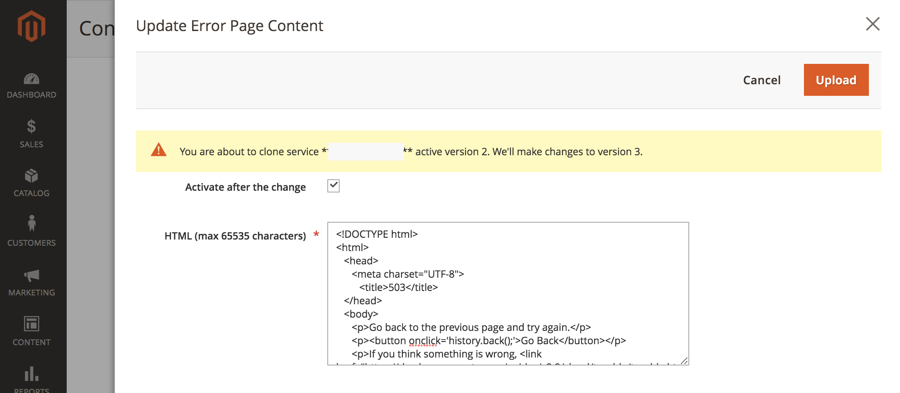

# Anpassen von Fehler- und Wartungsseiten

Wenn eine Anfrage an den Fastly-Ursprung fehlschlägt, gibt Fastly Standardantwortseiten mit einfacher Formatierung und generischem Messaging zurück, die für Benutzende verwirrend sein können. Beispielsweise gibt Fastly die folgende Standardfehlerseite zurück, wenn eine Anfrage an den Fastly-Ursprung aufgrund eines 503-Fehlers fehlschlägt.


Sie können Ihre Adobe Commerce-Store-Konfiguration aktualisieren, um einige standardmäßige Antwortseiten durch Seiten zu ersetzen, die benutzerfreundlicheres Messaging und verbessertes HTML-Styling aufweisen, wie im folgenden Beispiel gezeigt.


Derzeit können Sie die folgenden Fastly-Antwortseiten für Ihr Adobe Commerce in Cloud-Infrastrukturprojekt anpassen.

- [Server-Fehler - Interner Server-Fehler, Zeitüberschreitung oder Ausfall der Website-Wartung (Fehler-Code 500 oder höher)](#customize-the-503-error-page)
- [WAF blockiert Ereignisse, die auftreten, wenn WAF verdächtigen Anfrage-Traffic erkennt (403 Verboten)](#customize-the-waf-error-page)

**HTML-Codierungsanforderungen:**

Der HTML-Code für die benutzerdefinierte Seite muss die folgenden Anforderungen erfüllen:

- Inhalte können bis zu 65.535 Zeichen lang sein.
- Geben Sie alle CSS-Dateien inline in der HTML-Quelle an.
- Bundle Bilder auf der HTML-Seite mit base64, sodass sie auch dann angezeigt werden, wenn Fastly offline ist. Siehe [Daten-URIs auf der Website für CSS-Tricks](https://css-tricks.com/data-uris/).

## Anpassen der 503-Fehlerseite

Kunden sehen in den folgenden Fällen die standardmäßige 503-Fehler-Seite:

- Wenn eine Anfrage an den Fastly-Ursprung einen Antwortstatus größer als 500 zurückgibt
- Wenn der Fastly-Ursprung ausfällt, z. B. eine Zeitüberschreitung, eine Wartungsaktivität oder Gesundheitsprobleme

Sie können die Standardseite anpassen, indem Sie den folgenden HTML-Code anpassen, um den Stil an Ihr Adobe Commerce-Store-Design anzupassen, und den Titel und die Nachricht nach Bedarf ändern.

```html
<!DOCTYPE html>
<html>
   <head>
      <meta charset="UTF-8">
         <title>503</title>
   </head>
   <body>
      <p>Service unavailable</p>
   </body></html>
```

Stellen Sie sicher, dass die geänderte Quelle im Browser korrekt angezeigt wird. Fügen Sie dann den angepassten HTML-Code zur Fastly-Konfiguration hinzu.

So fügen Sie die benutzerdefinierte Antwortseite zur Fastly-Konfiguration hinzu:

{{admin-login-step}}

1. Wählen Sie **Stores** > **Einstellungen** > **Konfiguration** > **Erweitert** > **System**.

1. Erweitern Sie im rechten Bereich **Vollständiger Seiten-Cache** > **Fastly-Konfiguration** > **Benutzerdefinierte synthetische Seiten**.

   

1. Wählen Sie **HTML einstellen**.

1. Kopieren Sie den Quell-Code für Ihre benutzerdefinierte Antwortseite und fügen Sie ihn in das Feld HTML ein.

   

1. Wählen **oben auf** Seite „Hochladen“ aus, um die angepasste HTML-Quelle auf den Fastly-Server hochzuladen.

1. Wählen **oben auf** Seite „Konfiguration speichern“ aus, um die aktualisierte Konfigurationsdatei zu speichern.

1. Aktualisieren Sie den Cache.

   - Klicken Sie in der Benachrichtigung oben auf der Seite auf den Link *Cache-Verwaltung* .

   - Wählen Sie auf der Seite Cache-Verwaltung **Leeren des Magento-Cache** aus.

## Anpassen der WAF-Fehlerseite

Kundinnen und Kunden sehen die folgende standardmäßige WAF-Fehlerseite, wenn eine Anfrage an die Fastly-Herkunft mit einem `403 Forbidden` Fehler fehlschlägt, der durch ein [WAF](fastly-waf-service.md)Blockierungsereignis verursacht wird.


Das folgende Codebeispiel zeigt die HTML-Quelle für die Standardseite:

```html
<html>
  <head>
    <title>Magento 403 Forbidden</title>
  </head>
  <body>
    <p>The requested URL was rejected.</p>
    <p>For additional information, please contact support and provide this reference ID:</p>
    <p>"} req.http.x-request-id {"</p>
    <p><button onclick='history.back();'>Go Back</button></p>
  </body>
</html>
```

Sie können die Option **Benutzerdefinierte synthetische Seiten** > **WAF-Seite bearbeiten** im Fastly-Konfigurationsmenü verwenden, um den Standardcode für Ihr Adobe Commerce in Cloud-Infrastrukturprojekt anzupassen. Wenn Sie den Code bearbeiten, behalten Sie die folgende Zeile bei, die die Referenz-ID für das WAF-Blockierungsereignis bereitstellt:

```html
<p>"} req.http.x-request-id {"</p>
```

>[!NOTE]
>
>Die Option WAF bearbeiten ist nur verfügbar, wenn der Managed Cloud WAF-Service für Ihr Adobe Commerce in einem Cloud-Infrastrukturprojekt aktiviert ist.

**So bearbeiten Sie die WAF-Fehlerseite**:

1. [Beim Administrator anmelden](../../get-started/onboarding.md#access-your-admin-panel).

1. Wählen Sie **Stores** > **Einstellungen** > **Konfiguration** > **Erweitert** > **System**.

1. Erweitern Sie im rechten Bereich **Vollständiger Seiten-Cache** > **Fastly-Konfiguration** > **Benutzerdefinierte synthetische Seiten**.

   

1. Wählen Sie **WAF-Seite bearbeiten** aus.

1. Füllen Sie die Felder zum Aktualisieren der HTML aus.

   

   - **Status** - Wählen Sie den `403 Forbidden` aus.
   - **MIME type** — Typ `text/html`.
   - **Inhalt** - Bearbeiten Sie die Standard-HTML-Antwort, um benutzerdefiniertes CSS hinzuzufügen und den Titel und die Nachricht nach Bedarf zu aktualisieren.

1. Wählen **oben auf** Seite „Hochladen“ aus, um die angepasste HTML-Quelle auf den Fastly-Server hochzuladen.

1. Wählen **oben auf** Seite „Konfiguration speichern“ aus, um die aktualisierte Konfigurationsdatei zu speichern.

1. Aktualisieren Sie den Cache.

   - Klicken Sie in der Benachrichtigung oben auf der Seite auf den Link **Cache-Verwaltung** .

   - Wählen Sie auf der Seite Cache-Verwaltung **Leeren des Magento-Cache** aus.

## Fehlerberichtnummer anzeigen

Standardmäßig werden in Fastly alle Adobe Commerce-Fehler hinter dem Fehler *503 Service Unavailable* ausgeblendet. Um die Nummer des Fehlerprotokollberichts anzuzeigen, damit Sie die Fehlerdetails in den Protokollen finden und überprüfen können, öffnen Sie die Website ohne Fastly und verwenden Sie dabei die folgenden Schritte:

1. Abrufen der IP-Adresse Ihres Stores:

   - Für Pro-Staging- und Produktionsumgebungen:

     ```bash
     nslookup {your_project_id}.ent.magento.cloud
     ```

   - Für Pro-Integrationsumgebungen und Starter-Umgebungen:

     ```bash
     nslookup gw.{your_region}.magentosite.cloud
     ```

1. Fügen Sie Ihre Anwendungsdomäne und IP-Adresse zur Hosts-Datei auf Ihrer lokalen Workstation hinzu:

   ```text
   {server_IP} {store_domain}
   ```

1. Löschen Sie den Browser-Cache und die Cookies (oder wechseln Sie in den Inkognito-Modus).

1. Öffnen Sie Ihre Store-Website erneut, um den Fehlercode anzuzeigen.

1. Verwenden Sie den Fehlercode, um die Details in der Fehlerberichtsdatei zu finden:

   - [Herstellen einer Verbindung zur betroffenen Umgebung über SSH](../development/secure-connections.md#connect-to-a-remote-environment)

   - Suchen Sie die `./var/report/{error_number}`.
