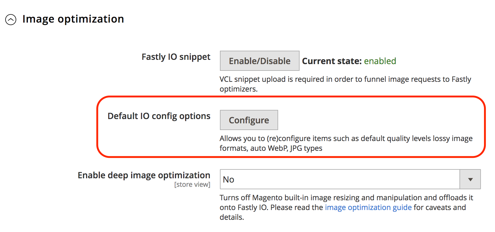

# Fastly-Bildoptimierung

Fastly Image Optimization (Fastly IO) bietet Echtzeit-Bildbearbeitung und -optimierung, um die Bildbereitstellung zu beschleunigen und die Wartung von Bildquellen für responsive Web-Anwendungen zu vereinfachen. Nach der Konfiguration bietet Fastly IO die folgenden Bildoptimierungsfunktionen:

- Verlustbehaftete Konversion erzwingen
- Tiefenbildoptimierung
- Adaptive Pixelverhältnisse
- Unterstützung gängiger Bildformate: PNG, JPEG, GIF und WebP

Bevor Sie die Option Fastly IO aktivieren und konfigurieren, müssen Sie Ihren Fastly-Service einrichten und die Origin-Abschirmung konfigurieren.

Basierend auf Ihren Konfigurationseinstellungen fügt der Code Fastly Image Optimization (Fastly IO) den VCL-Code ein, um die Bildoptimierung durchzuführen, die die Bereitstellung von Produktbildern in der Storefront beschleunigt. Es gibt drei Schritte zum Konfigurieren der Fastly-E/A: Aktivieren, Konfigurieren und Überprüfen.

## Fastly IO aktivieren

Aktivieren Sie Fastly Image Optimization (Fastly IO) über das Admin-Bedienfeld, indem Sie das Snippet Fastly IO VCL hochladen. Der Ausschnitt bietet die Fastly-Konfigurationsanweisungen, um alle Bilder mithilfe von Bildoptimierern und Standardkonfigurationen zu verarbeiten.

**Voraussetzungen:**

- Installieren oder Aktualisieren auf Fastly-Modul Version 1.2.62 oder höher
- [Konfigurieren von Fastly Origin Shield und Back-End](fastly-custom-cache-configuration.md#configure-back-ends-and-origin-shielding)

**So aktivieren Sie Fastly IO**:

1. Melden Sie sich bei Ihrem lokalen [Admin](../../get-started/onboarding.md#access-your-admin-panel)-Bedienfeld als Administrator an.

1. Wählen Sie **Stores** > **Einstellungen** > **Konfiguration** > **Erweitert** > **System**.

1. Erweitern Sie im rechten Bereich **Vollständiger Seitencache**.

1. Wählen Sie **Fastly Configuration** > **Image Optimization** aus, um die Konfigurationseinstellungen anzugeben.

1. Wählen Sie im Feld _Fastly IO Snippet_ die Option **Aktivieren/Deaktivieren** aus.

1. Laden Sie das Fastly IO-Snippet hoch:

   - Wählen Sie **Standard-IO-Konfigurationsoptionen** aus, um die Seite mit den standardmäßigen Konfigurationsoptionen für die Bildoptimierung zu öffnen.
   - Wählen Sie **Hochladen** aus, um das VCL-Snippet auf Ihren Server hochzuladen.

## Fastly IO konfigurieren

Überprüfen und aktualisieren Sie die standardmäßigen E/A-Konfigurationseinstellungen für die Bildoptimierung nach Bedarf. Beispielsweise können Sie die Qualitätsstufen von WebP und JPEG für verlustbehaftete Formate ändern oder das Format für die Bereitstellung von JPEG-Bildern auf _Progressiv_ oder _Grundlinie_ ändern. Außerdem können Sie Fastly IO für detailliertere Bildoptimierungsfunktionen verwenden, wie z. B.:

- Verlustbehaftete Konversion erzwingen
- Tiefenbildoptimierung
- Adaptive Pixelverhältnisse

**So aktualisieren Sie Fastly IO**:

1. Wählen Sie auf der _Fastly_ Konfigurationsseite im Feld _Default IO Config Options_ die Option **Konfigurieren** aus.

   

1. Überprüfen und aktualisieren Sie die Fastly IO-Konfigurationseinstellungen auf der Seite _Standardkonfigurationsoptionen für die Bildoptimierung_:

   

   - **Auto WebP?** - Lassen Sie die Standardeinstellung (`Yes`), um Bilder in Browsern, die sie unterstützen, in das WebP-Format zu konvertieren. Wenn Sie die Einstellung in **Nein** ändern, verwendet Fastly den Bilddateityp, anstatt das Bild in das WebP-Format zu konvertieren.

   - **Standard-WebP-Qualität (verlustbehaftet** - Behalten Sie die Standardeinstellung (`85`) bei oder geben Sie den Komprimierungsgrad für verlustbehaftete dateiformatierte Bilder ein. Sie können eine beliebige Ganzzahl zwischen 1 und 100 angeben.

   - **Standard-Steuerelemente für das JPEG** - Lassen Sie die Standardeinstellung (`Auto`) unverändert, oder wählen Sie den JPEG-Typ aus, der bei der Bereitstellung eines Bildes verwendet werden soll. Wenn der Wert auf &quot;_&quot; festgelegt ist_ liefert Fastly Bilder mit einem Ausgabetyp, der dem Eingabetyp entspricht. Wählen Sie _Grundlinie_ aus, um die Bilder Zeile für Zeile anzuzeigen, beginnend von oben links bis unten rechts. Wählen Sie _Progressiv_ aus, um ein verschwommenes Bild anzuzeigen, das beim Laden deutlich wird.

   - **Standard-JPEG-Qualität** - Lassen Sie die Standardeinstellung (`85`), oder geben Sie den Komprimierungsgrad für die Qualität verlustbehafteter Dateiformate ein. Geben Sie eine beliebige Ganzzahl zwischen 1 und 100 an.

   - **Hochskalierung zulassen?** - Lassen Sie die Standardeinstellung (`No`) unverändert, oder wählen Sie `Yes` aus, um Bilder zurückzugeben, die größer sind als die ursprüngliche Quelldatei, damit sie den angeforderten Abmessungen entsprechen.

   - **Filter ändern** - Lassen Sie die Standardeinstellung (`Lancsoz3`) unverändert oder wählen Sie eine Alternative aus. Diese Einstellung gibt den Filter an, der zum Bereitstellen eines Bildes in der Größe verwendet wird. Je nach ausgewähltem Filter kann das skalierte Bild eine höhere oder niedrigere Anzahl von Pixeln aufweisen.

      - `Lanczos3` (Standard) - Liefert die beste Bildqualität. Es erhöht die Fähigkeit, Kanten und lineare Merkmale innerhalb eines Bildes zu erkennen, und verwendet _[!DNL sinc]_Resampling, um die bestmögliche Rekonstruktion zu erzielen.
      - `Lanczos2` - Verwendet denselben Filter wie `Lancsoz3`, jedoch mit einer weniger genauen Annäherung an die _[!DNL sinc]_-Neuberechnungsfunktion.
      - `Bicubic` - Hat einen natürlichen Scharfzeichnungseffekt, wenn ein Bild kleiner wird.
      - `Bilinear` - Hat einen natürlichen Glättungseffekt, wenn ein Bild größer wird.
      - `Nearest` - Beim Ändern der Größe von Pixel-Art hat dies einen natürlichen Pixeleffekt.

1. Nachdem Sie die IO-Konfigurationseinstellungen für den Fastly-Service angegeben haben, wählen Sie **Abbrechen** aus, um zu den Fastly-Konfigurationseinstellungen zurückzukehren.

1. Wählen Sie im Feld Bildoptimierungskonfiguration _Deep-Image_ Optimierung aktivieren **„Ja**, um die Deep-Image-Optimierung zu aktivieren.

   

   Die Tiefenbildoptimierung ist standardmäßig deaktiviert. Wenn diese Funktion aktiviert ist, wird die integrierte Größenänderungsfunktion in Adobe Commerce deaktiviert und die Größenänderungsarbeit wird in den Fastly IO-Service abgeladen. Die Bildoptimierung gilt nur für Produktbilder. Die Größe der CMS-Bilder wird nicht geändert. Siehe die [Fastly-](#deep-image-optimization).

1. Aktivieren Sie nach der Aktivierung der Tiefenbildoptimierung die Funktion [Adaptive Pixel Ratios](#adaptive-pixel-ratios), um Bilder zu generieren, die für die Verwendung auf responsiven Websites optimiert sind.

   

   - Wählen Sie im Feld _Adaptive Gerätepixelverhältnisse aktivieren_ die Option **Ja**.
   - Akzeptieren Sie im Feld _Gerätepixelverhältnis_ die Standardeinstellung, oder aktivieren Sie das Kontrollkästchen **Systemeingabe**, um die Einstellung zu entfernen. Wählen Sie dann das gewünschte Verhältnis aus. Eine höhere Einstellung für das Gerätepixelverhältnis liefert größere Bilder.

1. Wählen Sie **Konfiguration speichern**.

### Verlustbehaftete Konversion erzwingen

Standardmäßig erzwingt der Fastly IO-Service die Konvertierung verlustfreier Formate wie PNG, BMP oder WEBP in das JPEG/WEBP-Format.

Der Vorteil der erzwungenen verlustreichen Konvertierung besteht darin, dass kleinere Bilder bereitgestellt werden.
Wenn Sie beispielsweise das JPEG- oder WEBp-Format anstelle von PNG verwenden, kann die Größe je nach dem in der Fastly IO-Konfiguration angegebenen Qualitätsniveau um 60 bis 70 Prozent reduziert werden.

Je nach ausgewähltem Qualitätsniveau für die Bildoptimierung können Sie visuelle Unterschiede in Bildern wahrnehmen. Beispielsweise werden Alpha-Kanäle/Transparenzen entfernt und durch einen weißen Hintergrund ersetzt, es sei denn, Sie verwenden Deep Image Optimization , die die Hintergrundfarbe Ihres Designs verwendet.

Wenn Sie verlustbehaftete Konvertierung (`WebP Auto? = No`) deaktivieren, ändert Fastly IO nur JPEG-Images für kompatible Browser in das WEBP-Format. Es werden keine anderen Bildtypen geändert. Wenn das Originalbild beispielsweise PNG ist, ist die Ausgabe des Fastly IO-Service PNG.

### Tiefenbildoptimierung

Die Tiefenbildoptimierung ist standardmäßig deaktiviert. Durch Aktivierung dieser Option wird die integrierte Größenanpassung von Adobe Commerce deaktiviert und vollständig auf den Fastly IO-Service abgeladen.
Mit dieser Funktion wird nur die Größe _Produkt_-Bilder geändert. Die Größe der CMS-Bilder wird nicht geändert.

Durch die Aktivierung der Optimierung für tiefe Bilder wird jedem Bild, wie im Design definiert, eine Hintergrundfarbdefinition hinzugefügt. Dadurch wechseln WebP-Bilder von WebP verlustfrei zu WebP verlustfrei. Einer der Hauptunterschiede zwischen verlustfrei und verlustbehaftet ist, dass verlustbehaftete den Alphakanal aus PNG-Bildern entfernt, was viel kleinere Bilder liefert. Bilder mit Transparenz können jedoch auf Produkt- und Kampagnenseiten mit einem anderen Hintergrund seltsam aussehen.

Beispielsweise stellt der folgende Code die ursprüngliche Quelle für ein Bild aus dem Luma-Design dar:

```html

```

Wenn die Deep-Image-Optimierungsfunktion von Fastly IO aktiviert ist, wird der ursprüngliche Quell-Code für das Bild neu geschrieben, wie im folgenden Beispiel gezeigt:

```html

```

### Adaptive Pixelverhältnisse

Die Funktion für adaptive Pixelverhältnisse ist nützlich, um Bilder für progressive Web-Anwendungen zu optimieren. So können Sie mehrere Bildgrößen und Auflösungen aus einer Bildquelldatei bereitstellen, indem Sie für jedes Produktbild einen `srcset` hinzufügen.

Wenn die Funktion für adaptive Pixelverhältnisse aktiviert ist, liefert der Fastly IO-Service ein Bild mit fester Breite, das an unterschiedliche `device-pixel-ratios` angepasst werden kann.
Beispielsweise ändert der Service die Produktbilddefinition, wie im folgenden Beispiel gezeigt:

```html

```

Siehe `srcset` [Browser-Unterstützung](https://caniuse.com/#feat=srcset) und [Spezifikation](https://html.spec.whatwg.org/multipage/embedded-content.html#attr-img-srcset).

## Fastly IO validieren

Nachdem Sie Fastly IO aktiviert und konfiguriert haben, validieren Sie Ihre Konfiguration, indem Sie Web-Seiten-Geschwindigkeitstests mit und ohne aktiviertem Fastly IO durchführen. Überprüfen Sie außerdem die Bilder in Ihrem Store, um die Bildgröße und das Erscheinungsbild auf Probleme zu überprüfen.
