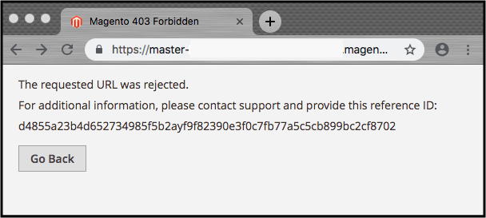

# Web Application Firewall (WAF)

Der auf Fastly basierende WAF-Service (Web Application Firewall) für Adobe Commerce auf Cloud-Infrastrukturen erkennt, protokolliert und blockiert den Traffic bösartiger Anfragen, bevor er Ihre Websites oder Ihr Netzwerk beschädigen kann. Der WAF-Service ist nur für Produktionsumgebungen verfügbar.

Der WAF-Service bietet die folgenden Vorteile:

- **PCI-Compliance** - Die Aktivierung von WAF stellt sicher, dass die Storefronts von Adobe Commerce in Produktionsumgebungen die Sicherheitsanforderungen von PCI DSS 6.6 erfüllen.
- **Standard-WAF-Richtlinie**: Die standardmäßige WAF-Richtlinie, die von Fastly konfiguriert und gepflegt wird, bietet eine Sammlung von Sicherheitsregeln, die darauf zugeschnitten sind, Ihre Adobe Commerce-Web-Anwendungen vor einer Vielzahl von Angriffen zu schützen, einschließlich Injektions-Angriffen, böswilligen Eingaben, Cross-Site-Scripting, Datenexfiltration, HTTP-Protokollverletzungen und anderen [OWASP Top Ten](https://owasp.org/www-project-top-ten/)-Sicherheitsbedrohungen.
- **WAF-Onboarding und -Aktivierung** - Adobe stellt die standardmäßige WAF-Richtlinie innerhalb von 2 bis 3 Wochen nach der endgültigen Bereitstellung in Ihrer Produktionsumgebung bereit und aktiviert sie.
- **Support für Betrieb und Wartung**—
   - Adobe und Schnelle Einrichtung und Verwaltung Ihrer Protokolle, Regeln und Warnhinweise für den WAF-Service.
   - Adobe löst Support-Tickets für Kunden im Zusammenhang mit Problemen mit dem WAF-Service aus, die legitimen Traffic als Probleme der Priorität 1 blockieren.
   - Automatisierte Upgrades der WAF Service-Version gewährleisten eine sofortige Abdeckung neuer oder sich entwickelnder Exploits. Siehe [Wartung und Upgrades für WAF](#waf-maintenance-and-updates).

>[!TIP]
>
>Weitere Informationen zur Aufrechterhaltung der PCI-Compliance für Ihre Adobe Commerce in Cloud-Infrastrukturspeichern finden Sie unter [PCI-Compliance](https://business.adobe.com/products/magento/pci-compliance.html).

## Aktivieren der WAF

Adobe aktiviert den WAF-Service für neue Konten innerhalb von 2 bis 3 Wochen nach der endgültigen Bereitstellung. Die WAF wird über den Fastly CDN-Service implementiert. Sie müssen weder Hardware noch Software installieren oder warten.

>[!NOTE]
>
>Bevor Sie den WAF-Service verwenden können, müssen Sie den gesamten externen Traffic zu Ihrem Adobe Commerce in einem Cloud-Infrastrukturprojekt über den Fastly-Service leiten. Siehe [Schnelles Setup](fastly-configuration.md).

## Funktionsweise

Der WAF-Service integriert sich mit Fastly und verwendet die Cache-Logik innerhalb des Fastly CDN-Service, um Traffic auf den globalen Fastly-Knoten zu filtern. Wir aktivieren den WAF-Service in Ihrer Produktionsumgebung mit einer standardmäßigen WAF-Richtlinie, die auf [ModSecurity-Regeln von Trustwave SpiderLabs](https://github.com/owasp-modsecurity/ModSecurity) und den OWASP Top 10-Sicherheitsbedrohungen basiert.

Der WAF-Service überprüft HTTP- und HTTPS-Traffic (GET- und POST-Anfragen) anhand des WAF-Regelsatzes und blockiert bösartigen Traffic, der bestimmten Regeln nicht entspricht. Der Service untersucht nur den ursprünglichen Traffic, der versucht, den Cache zu aktualisieren. Daher stoppen wir den Großteil des Angriffsverkehrs im Fastly-Cache und schützen Ihren Ursprungs-Traffic vor bösartigen Angriffen. Durch die Verarbeitung des Ursprungs-Traffics behält der WAF-Service die Cache-Leistung bei und führt für jede nicht zwischengespeicherte Anfrage eine Latenz von schätzungsweise 1,5 Millisekunden bis 20 Millisekunden ein.

## Fehlerbehebung bei blockierten Anfragen

Wenn der WAF-Service aktiviert ist, prüft er den gesamten Web- und Admin-Traffic anhand der WAF-Regeln und blockiert jede Web-Anfrage, die eine Regel Trigger. Wenn eine Anfrage blockiert wird, wird dem Anfragenden eine standardmäßige `403 Forbidden` angezeigt, die eine Referenz-ID für das Blockierungsereignis enthält.

Sie können diese Fehlerantwortseite über den Administrator anpassen. Siehe [Anpassen der WAF-](fastly-custom-response.md#customize-the-waf-error-page).

Wenn Ihre Adobe Commerce-Adminseite oder Storefront als Antwort auf eine rechtmäßige URL-Anfrage eine `403 Forbidden` Fehlerseite zurückgibt, senden Sie ein [Adobe Commerce-Support-Ticket](https://experienceleague.adobe.com/en/docs/commerce-knowledge-base/kb/help-center-guide/magento-help-center-user-guide#support-case). Kopieren Sie die Referenz-ID aus der Fehlerantwortseite und fügen Sie sie in die Ticketbeschreibung ein.

Informationen zur Identifizierung der WAF-Antwort für eine bestimmte Anfrage mithilfe von New Relic finden Sie unter:

- `Agent_response` - Gibt den WAF-Antwort-Code an (`200` bedeutet gut und `406` bedeutet blockiert)
- `sigsci`-Tags - Kennzeichnet die Anfrage anhand der Art der Anfrage mit einem bestimmten signalwissenschaftlichen Tag

## Wartung und Updates für WAF

Fastly aktualisiert und implementiert Patches für neue CVEs/Vorlagenregeln basierend auf Regelaktualisierungen von kommerziellen Drittanbietern, Fastly Research und Open Sources. Aktualisiert die veröffentlichten Regeln schnell nach Bedarf oder wenn Änderungen an den Regeln aus ihren jeweiligen Quellen verfügbar sind. Außerdem kann Fastly Regeln, die mit den veröffentlichten Regelklassen übereinstimmen, zur WAF-Instanz eines beliebigen Services hinzufügen, nachdem der WAF-Service aktiviert wurde. Diese Updates gewährleisten eine sofortige Abdeckung neuer oder sich entwickelnder Exploits.

Adobe und Fastly verwalten den Aktualisierungsprozess, um sicherzustellen, dass neue oder modifizierte WAF-Regeln effektiv in Ihrer Produktionsumgebung funktionieren, bevor die Aktualisierungen im Blockierungsmodus bereitgestellt werden.

## Probleme

Wenn Sie feststellen, dass der WAF legitime Anfragen blockiert, sind diese häufig falsch-positiv und müssen übersprungen werden, oder es muss eine Problemumgehung über den WAF-Service implementiert werden. Senden Sie ein Support-Ticket und geben Sie die betroffene URL, die genauen Schritte zur Reproduktion des Fehlers und die Fehlerreferenz im Textformular (im Gegensatz zu einem Screenshot) an, um Transkriptionsfehler zu vermeiden.

## Einschränkungen

Der standardmäßige WAF-Service, der von Fastly unterstützt wird, unterstützt die folgenden Funktionen nicht:

- Schutz vor Malware oder Bot-Schutz - Erwägen Sie [&#x200B; Verwendung von &#x200B;](./fastly-vcl-allowlist.md) oder Drittanbieterdiensten.
- Ratenbegrenzung - Siehe [Ratenbegrenzung](https://github.com/fastly/fastly-magento2/blob/master/Documentation/Guides/RATE-LIMITING.md) in der Fastly-Dokumentation oder [Ratenbegrenzung](https://developer.adobe.com/commerce/webapi/get-started/rate-limiting/) im Sicherheitsabschnitt _Commerce Web API_.
- Konfigurieren eines Protokollierungsendpunkts für den Kunden - Siehe [PrivateLink-](../development/privatelink-service.md)) als Alternative.

Mit dem WAF-Service können Sie Traffic basierend auf IP-Adressen blockieren oder zulassen. Sie können Ihrem Fastly-Service Zugriffssteuerungslisten (ACL) und benutzerdefinierte VCL-Snippets hinzufügen, um die IP-Adressen und die VCL-Logik zum Blockieren oder Zulassen von Traffic anzugeben. Siehe [Benutzerdefinierte Fastly-VCL-Snippets](fastly-vcl-custom-snippets.md).

Das Filtern nach TCP-, UDP- oder ICMP-Anfragen wird vom WAF-Service nicht unterstützt. Diese Funktionalität wird jedoch durch den integrierten DDoS-Schutz bereitgestellt, der im Fastly CDN-Service enthalten ist. Siehe [DoS-Schutz](fastly.md#ddos-protection).

