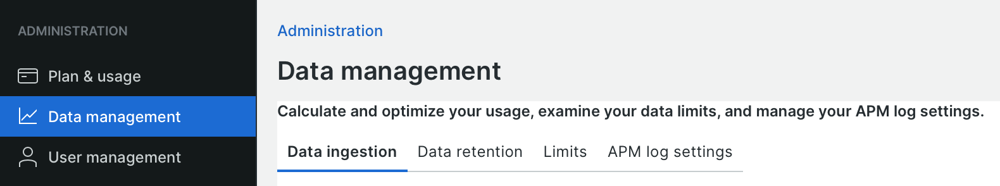

# Datenaufnahme

New Relic ist auf umfangreiche Daten angewiesen, um eine effektive Überwachung und Analyse zu ermöglichen. Große Datensätze können jedoch die rechtzeitige Bereitstellung von Ergebnissen, Leistung und Compliance beeinträchtigen. Dieses Thema enthält einige Anleitungen zum Verwalten der Datenaufnahme und Strategien zur Verfeinerung Ihrer Daten, sodass sie am effektivsten sind.

New Relic bietet eine _Daten-Management_-Ansicht, die Ihre Plannutzung nach Datenquelle zusammenfasst.

**So zeigen Sie Ihre aufgenommenen Daten und Quellen an**:

1. Klicken Sie im New Relic-Benutzermenü auf **[!UICONTROL Manage your data]**.
1. Klicken Sie in der Liste _Administration_ auf **[!UICONTROL Data management]**.

   

   Auf der Registerkarte **[!UICONTROL Data ingestion]** werden die Daten angezeigt, die für den jeweiligen Tag und die Datenquelle aufgenommen wurden.
Die Registerkarte Datenaufbewahrung zeigt an und steuert, wie lange Daten gespeichert werden.

1. Wählen Sie die Registerkarte **[!UICONTROL Limits]** aus und sehen Sie sich die Beschränkungen für Ihr Konto an.

Zu den Datenquellen für Adobe Commerce gehören:

- **APM-Ereignisse** - Ereignisdaten, die in Diagrammen und Dashboards verwendet werden
- **Infrastruktur** - Prozess- und Host-Metriken wie CPU, Speicher, Netzwerke
- **Logging** - Protokolle für CDN, APM und Anwendungs-Server

Protokolldaten tragen zu einem großen Teil zur Aufnahme bei. Erfahren Sie, wie [Protokolldaten anzeigen und analysieren](log-management.md#view-and-analyze-log-data) und mit Ihrem Adobe-Support-Mitarbeiter zusammenarbeiten können, um eine Strategie für die Datenaufnahme und -speicherung zu entwickeln. Weitere Informationen zum [Verwalten der Datenaufnahme](https://docs.newrelic.com/docs/data-apis/manage-data/manage-data-coming-new-relic/) finden Sie in der _Dokumentation zu New Relic_.
