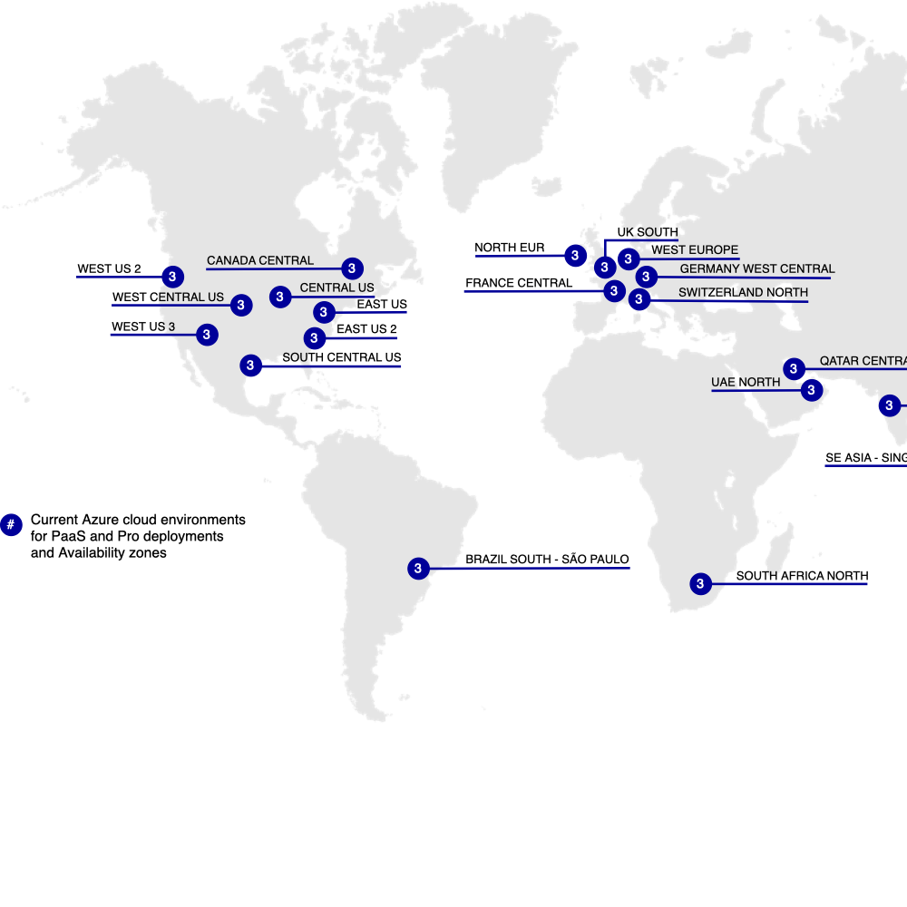

# Commerce auf Cloud-Infrastruktur

Adobe Commerce on Cloud Infrastructure bietet eine automatisierte Hosting-Plattform mit einem **Self-Service**-Ansatz für das Erstellen, Bereitstellen und Verwalten Ihrer [!DNL Commerce]-Anwendung in einer Cloud-nativen Umgebung. Adobe Commerce on Cloud Infrastructure verfügt über zusätzliche Funktionen, die es von den On-Premise-Plattformen Adobe Commerce und Magento Open Source unterscheiden:

- Eine vorab bereitgestellte Infrastruktur, die PHP, MySQL (MariaDB), Redis, Message Queue Services ([!DNL RabbitMQ] oder [!DNL ActiveMQ]) und unterstützte Suchmaschinentechnologien umfasst.
- Git-basierter Workflow mit automatischer Erstellung und Bereitstellung für eine effiziente schnelle Entwicklung und kontinuierliche Bereitstellung jedes Mal, wenn Sie Code-Änderungen in eine Platform as a Service (PaaS)-Umgebung pushen.
- Hochgradig anpassbare Umgebungskonfigurationsdateien und Befehlszeilenschnittstellen-Tools (Command-Line Interface, CLI) verwalten und bereitstellen.
- Amazon Web Services (AWS)-Hosting, das eine skalierbare und sichere Umgebung für Online-Vertrieb und -Einzelhandel bietet.

>[!NOTE]
>
>Weitere Informationen zur Sicherheit finden Sie unter [Checkliste für den Sicherheitsstart](https://experienceleague.adobe.com/de/docs/commerce-on-cloud/user-guide/launch/checklist#security-configuration).

Sehen Sie sich den [Technologie-Stack](architecture/tech-stack.md) im Detail an oder erfahren Sie mehr über bestimmte Funktionen und unterstützte Produkte in [Cloud-Architektur für Commerce](architecture/cloud-architecture.md).

## Cloud-Regionen

In den folgenden Abschnitten finden Sie Details zu den verschiedenen Regionen von AWS und Azure, die für Adobe Commerce in der Cloud-Infrastruktur verfügbar sind.

## AWS-Regionen

{zoomable="yes"}

>[!NOTE]
>
> Nur lokal in China und Russland.

## Azure-Regionen

{zoomable="yes"}

>[!NOTE]
>
> Nur lokal in China und Russland. Alle Händler, für die Integrationsumgebungen erforderlich sind, müssen US-Regionen verwenden.

## Dokumentation zu Adobe Commerce

Das Handbuch zu Commerce in Cloud-Infrastrukturen setzt voraus, dass Sie über Grundkenntnisse und Kenntnisse der Adobe Commerce-Anwendung verfügen. Weitere Informationen finden Sie im [!DNL Commerce] Entwickler- und Benutzerhandbuch unten:

- [Adobe Commerce-Entwicklerdokumentation](https://developer.adobe.com/commerce/docs/) (Adobe Developer-Site) - Entwickeln, Anpassen, Integrieren, Erweitern und Verwenden erweiterter Funktionen

- [Dokumentation zu Adobe Commerce](https://experienceleague.adobe.com/docs/commerce.html?lang=de) (Adobe Experience League) - Planen, Implementieren, Betreiben, Aktualisieren und Verwalten Ihrer [!DNL Commerce]

{{$include /help/_includes/templated/whats-new.md}}

<!-- Last updated from includes: 2026-07-13 20:49:04 -->
