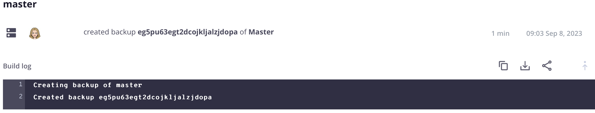

# Aktivitäts-Stream

In der Hauptansicht jeder Umgebung wird eine **Aktivität** Liste historischer Ereignisse ähnlich einem Git-Protokoll angezeigt. Die Liste Aktivität ist ein Stream der letzten Ereignisse für aktive Umgebungen. Im Folgenden finden Sie eine Liste der Aktivitätstypen und ihrer Symbole, die im Aktivitäts-Stream angezeigt werden:

{width="500" align="center"}

## Protokolle anzeigen

Klicken Sie in der Liste Aktivität auf das Statussymbol einer Aktivität, um das Protokoll anzuzeigen. Alternativ können Sie auf das Menü {width="32"} (_mehr_) klicken, um auf weitere Optionen zur Verwaltung der Aktivität zuzugreifen. Im Folgenden sehen Sie ein kurzes Protokoll zur Erstellung eines Backups. Sie können [die Cloud-CLI verwenden](#activity-stream-with-cloud-cli) um dasselbe Protokoll anzuzeigen.



## Verwalten einer Aktivität

Einige Aktivitäten haben den Status _Wird ausgeführt_ oder _Ausstehend_. Sie können auf eine laufende Aktivität reagieren, z. B. indem Sie eine laufende Bereitstellung abbrechen. Auf den folgenden Registerkarten werden zwei Methoden zum Abbrechen einer Aktivität angezeigt: die [!DNL Cloud Console] oder die Cloud-CLI.

>[!BEGINTABS]

>[!TAB Konsole]

**So brechen Sie eine Aktivität im[!DNL Cloud Console]** ab:

Sie können auf eine laufende Aktivität reagieren, indem Sie auf das Menü {width="32"} (_Mehr_) zugreifen und eine Aktion auswählen, z. B. `Cancel` oder `View log`. Wählen Sie für dieses Beispiel die Option **Abbrechen**, um die laufende Aktivität zu stoppen.

Nicht alle Aktivitäten haben die Abbruchoption. Beispielsweise wird die Option zum Abbrechen der Anwendungsbereitstellung nur während der Build _Phase_. Nachdem die Anwendung in die Bereitstellungsphase _wurde_ können Sie die Aktivität nicht mehr abbrechen. Siehe [Bereitstellungsprozess](../deploy/process.md) über die verschiedenen Phasen.

{width="450" align="center"}

Wenn auf einem Terminal die Bereitstellungsaktivität ausgeführt wird, führt ein Abbruch der [!DNL Cloud Console] zum Abbruch im Terminal:

{width="300"}

>[!TAB CLI]

**Abbrechen einer Aktivität in der Cloud-CLI**:

1. Identifizieren Sie die laufenden Aktivitäten und wählen Sie eine Aktivitäts-ID aus.

   ```bash
   magento-cloud activity:list --state=in_progress
   ```

1. Bricht die Aktivität mit der Aktivitäts-ID ab:

   ```bash
   magento-cloud activity:cancel wvl5wm7s5vkhy
   ```

>[!ENDTABS]

## Aktivitäts-Stream filtern

Die Möglichkeit, die Aktivitätenliste zu filtern, ist nützlich, wenn Sie nach etwas Bestimmtem suchen, z. B. einem Backup oder einem Zusammenführungsereignis.

**So filtern Sie die Aktivitätenliste in der[!DNL Cloud Console]**:

1. Wählen Sie eine Umgebung und die Ansicht Aktivitäts-**[!UICONTROL All]** aus, um den vollständigen Ereignisverlauf aufzunehmen.

1. Klicken Sie {width="32"} und wählen Sie die **[!UICONTROL Filter by]** Optionen aus:

   

1. Wählen Sie die Aktivität **[!UICONTROL Recent]** aus und setzen Sie die Liste zurück.

## Stream mit Cloud CLI anzeigen

Die `magento-cloud` CLI bietet fast die gleichen Funktionen wie die [!DNL Cloud Console]. Der `activity` Befehl kann:

- `list` des Aktivitätenstroms für eine Umgebung
- `get` Details zu einer bestimmten Aktivität
- Anzeigen der `log` für eine bestimmte Aktivität
- `cancel` einer Aktivität

**So zeigen Sie den Aktivitäts-Stream mit der Cloud-CLI**:

1. Listet die Aktivitäten für die aktuelle Umgebung auf.

   ```bash
   magento-cloud activity:list
   ```

1. Jede Aktivität verfügt über eine eindeutige ID. Wählen Sie eine ID aus der vorherigen Liste aus und zeigen Sie die Details für diese Aktivität an.

   ```bash
   magento-cloud activity:get wvl5wm7s5vkhy
   ```

1. Das vollständige Protokoll für diese Aktivität anzeigen.

   ```bash
   magento-cloud activity:log wvl5wm7s5vkhy
   ```

   Beispielantwort:

   ```bash
   Activity ID: wvl5wm7s5vkhy
   Type: environment.backup
   Description: User created a backup of Master
   Created: 2023-09-08T14:03:33+00:00
   State: complete
   Log:
   Creating backup of master
   Created backup eg5pu63egt2dcojkljalzjdopa
   ```
