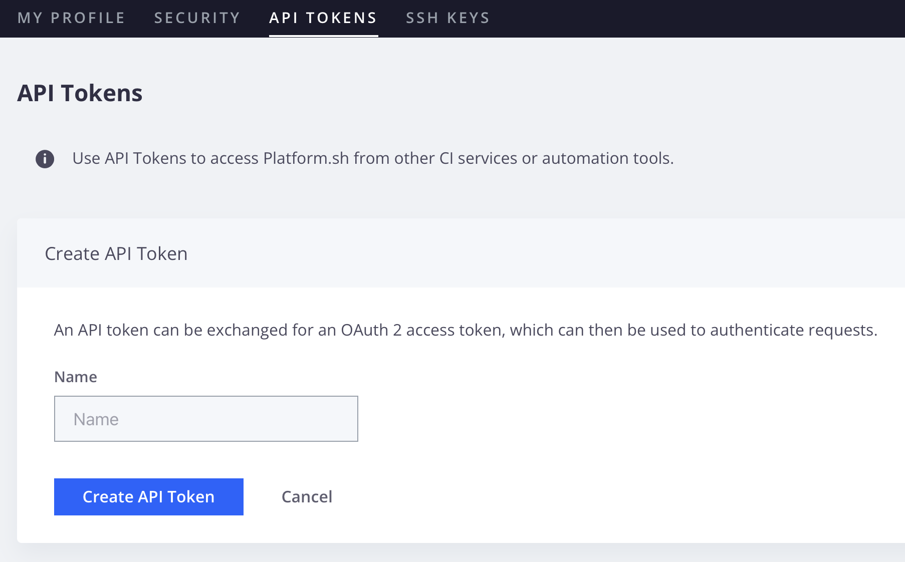

# Verwalten des Benutzerzugriffs

Adobe Commerce-Projekte in der Cloud-Infrastruktur verwenden rollenbasierten Zugriff. Auf Projektebene stehen zwei Rollen zur Verfügung:

- **Projektadministrator**: Schreibzugriff auf alle Projektumgebungen, Benutzerverwaltung, Push-Code und Aktualisierung der Projekteinstellungen. (Zuvor bekannt als **Superadmin**)
- **Projekt-Viewer**: Nur-Ansicht-Zugriff auf alle Projektumgebungen.

Projekt-Viewer können in keiner Umgebung Aufgaben ausführen. Sie können den Projekt-Viewern jedoch Schreibzugriff auf einen bestimmten Umgebungstyp gewähren.

Der Zugriff auf Umgebungsebene basiert auf dem Umgebungstyp: Produktion, Staging und Entwicklung. Wenn Sie einem Benutzer _Viewer_ Berechtigung für _Entwicklungsumgebungen_ erteilen, können **alle** Entwicklungsumgebungen im Projekt anzeigen. In der folgenden Tabelle werden die Funktionen erläutert, die den einzelnen Berechtigungsebenen gewährt werden:

| Berechtigungsstufe | Zugriff | SSH-Zugriff |
| ------------------ | ----------- | :----------: |
| **admin** | Führen Sie Administratoraufgaben aus, z. B. Einstellungen ändern, Push-Code senden, Aufgaben ausführen und Verzweigungen verwalten, einschließlich der Zusammenführung mit der übergeordneten Umgebung | Ja |
| **Mitwirkender** | Push-Code und Verzweigung in der Umgebung; Einstellungen können nicht geändert oder Aktionen ausgeführt werden | Ja |
| **Viewer** | Schreibgeschützter Zugriff auf den Umgebungstyp | Nein |
| **Kein Zugriff** | Kein Zugriff auf den Umgebungstyp | Nein |

{style="table-layout:auto"}

Sie können Benutzer hinzufügen und Rollen mithilfe der `magento-cloud` CLI oder der [!DNL Cloud Console] zuweisen.

>[!BEGINSHADEBOX]

**Voraussetzungen:**

- Ein registrierter Benutzer mit einer Adobe ID. Ein Benutzer muss [sich für ein Adobe-Konto ](https://account.adobe.com) und dann [sein Cloud-Konto initialisieren](https://console.adobecommerce.com) bevor Sie ihn zu einem Cloud-Projekt hinzufügen können.
- Ein Benutzer mit der Rolle **Admin** kann keine Benutzer mit der `magento-cloud` CLI verwalten. Nur Benutzer mit der Rolle **Kontoinhaber** können Benutzer verwalten.

>[!ENDSHADEBOX]

## Verwalten von Benutzern mit der CLI

Verwenden Sie die `magento-cloud` CLI, um Benutzer zu verwalten und eine Integration in automatisierte Systeme durchzuführen:

- `magento-cloud user:add`-Hinzufügen eines Benutzers zum Projekt
- `magento-cloud user:delete`-Löschen eines Benutzers
- Projektbenutzer auf die `magento-cloud user:list [users]` setzen
- Benutzerrolle `magento-cloud user:role` oder ändern
- Benutzerrolle in einem Projekt `magento-cloud user:update` aktualisieren

In den folgenden Beispielen wird die `magento-cloud`-CLI verwendet, um einen Benutzer hinzuzufügen, Rollen zu konfigurieren, Projektzuweisungen zu ändern und Benutzerrollen zuzuweisen.

**So fügen Sie einen Benutzer hinzu und weisen Rollen zu**:

1. Verwenden Sie die `magento-cloud` CLI, um den Benutzer hinzuzufügen.

   ```bash
   magento-cloud user:add
   ```

   >[!IMPORTANT]
   >
   >Der/die Benutzende muss über eine Adobe ID verfügen; siehe [Voraussetzungen](#add-users-and-manage-access).

1. Befolgen Sie die Anweisungen: Geben Sie die E-Mail-Adresse des Benutzers an, legen Sie die Rollen vom Typ Projekt und Umgebung fest und fügen Sie den Benutzer hinzu.

   > Eingabeaufforderungen im Beispiel

   ```
   Enter the user's email address: alice@example.com
   
   Email address: alice@example.com
   
   The user's project role can be admin (a) or viewer (v).
   
   Project role (default: viewer) [a/v]: viewer
   
   The user's environment type role(s) can be admin (a), viewer (v), contributor (c) or none (n).
   
   Role on type development (default: none) [a/v/c/n]: none
   Role on type production (default: none) [a/v/c/n]: admin
   Role on type staging (default: none) [a/v/c/n]: admin
   
   Adding the user alice@example.com to (project_id):
   Project role: viewer
     Role on type production: admin
     Role on type staging: admin
   
   Are you sure you want to add this user? [Y/n] y
   Adding the user to the project
   ```

   Nachdem Sie den Benutzer hinzugefügt haben, sendet Adobe eine E-Mail an die angegebene Adresse mit Anweisungen für den Zugriff auf das Adobe Commerce on Cloud Infrastructure-Projekt.

### Projektrolle eines Benutzers anzeigen

```bash
magento-cloud user:get alice@example.com
```

>Beispielantwort:

```
Current role(s) of User (alice@example.com) on Production (project_id):
  Project role: admin
```

### Hinzufügen eines Benutzers zu mehreren Umgebungen

So fügen Sie einen Benutzer als `viewer` in einer `Production` und als `contributor` in einer `Integration` hinzu:

```bash
magento-cloud user:add alice@example.com -r production:v -r integration:c
```

### Aktualisieren von Benutzerumgebungsberechtigungen

So aktualisieren Sie Benutzerumgebungsberechtigungen für `admin` in der `Production`:

```bash
magento-cloud user:update alice@example.com -r production:a
```

## Verwalten von Benutzern über die [!DNL Cloud Console]

Sie können die [[!DNL Cloud Console]](../../get-started/cloud-console.md) verwenden, um Berechtigungen hinzuzufügen, und die _Bearbeiten_-Funktion verwenden, um Berechtigungen für einen vorhandenen Benutzer zu ändern.

>[!IMPORTANT]
>
>Der/die Benutzende muss über eine Adobe ID verfügen; siehe [Voraussetzungen](#add-users-and-manage-access).

### Hinzufügen eines Benutzers zum Projekt

1. Melden Sie sich beim [[!DNL Cloud Console]](https://console.adobecommerce.com/) an.

1. Wählen Sie ein Projekt in der Liste _Alle Projekte_ aus.

1. Klicken Sie im Projekt-Dashboard oben rechts auf das Konfigurationssymbol.

1. Klicken _unter &quot;_&quot; auf **[!UICONTROL Access]**.

1. Klicken Sie in _Ansicht_ Zugriff **[!UICONTROL Add]** auf.

1. Füllen Sie das _[!UICONTROL Add User]_&#x200B;Formular aus:

   - Geben Sie die E-Mail-Adresse des Benutzers ein.

   - **[!UICONTROL Project admin]** - Gewähren von Administratorrechten für alle Einstellungen und Umgebungstypen.

   - **[!UICONTROL Environment types and permissions]** - Gewährt Zugriff und bestimmte Berechtigungsebenen für bestimmte Umgebungstypen. _Kein Zugriff_, _Admin_ (Einstellungen ändern, Aktion ausführen, Code zusammenführen), _Mitwirkender_ (Push-Code) oder _Viewer_ (nur Ansicht).

   >[!TIP]
   >
   >Nur ein **Projektadministrator** kann Benutzer in jeder Umgebung verwalten. Um einem Benutzer Zugriff auf die Registerkarte **Zugriff** zu gewähren, muss ein anderer **Projektadministrator** oder der **Kontoinhaber** diesem Benutzer die Rolle **Projektadministrator** zuweisen.

1. Klicken Sie auf **[!UICONTROL Add User]**.

   >[!IMPORTANT]
   >
   >Beim Hinzufügen von Benutzenden wird eine Bereitstellung nicht automatisch Trigger.

1. Nachdem Sie Benutzer hinzugefügt haben, stellen Sie alle Umgebungen erneut bereit, um die Änderungen anzuwenden. Beim Hinzufügen von Benutzenden wird eine Bereitstellung nicht automatisch Trigger. Die erneute Bereitstellung ist ein wichtiger Schritt, um sicherzustellen, dass Benutzende über SSH auf eine Umgebung zugreifen oder Administratoraufgaben durchführen können.

Nachdem Sie den Benutzer hinzugefügt haben, sendet Adobe eine E-Mail an die angegebene Adresse mit Anweisungen für den Zugriff auf das Adobe Commerce on Cloud Infrastructure-Projekt.

## Anforderungen an die Benutzerauthentifizierung

Um die Sicherheit zu erhöhen, bietet Adobe die Durchsetzung der Multi-Faktor-Authentifizierung (MFA) auf Projektebene, sodass eine Zwei-Faktor-Authentifizierung (TFA) für den SSH-Zugriff auf Adobe Commerce im Quell-Code und in Umgebungen von Cloud-Infrastrukturprojekten erforderlich ist. Siehe [Aktivieren von MFA für SSH](multi-factor-authentication.md).

Wenn die MFA-Durchsetzung für ein Adobe Commerce in einem Cloud-Infrastrukturprojekt aktiviert ist, müssen alle Benutzenden mit SSH-Zugriff auf eine Umgebung in diesem Projekt TFA in ihrem Adobe Commerce in einem Cloud-Infrastrukturkonto aktivieren. Für automatisierte Prozesse können Sie einen Computerbenutzer und ein API-Token erstellen, die sich über die Befehlszeile authentifizieren.

Nachdem Sie einen Benutzer zu einem Cloud-Projekt hinzugefügt haben, bitten Sie den Benutzer, seine Kontosicherheitseinstellungen zu überprüfen und die folgenden Sicherheitskonfigurationen nach Bedarf hinzuzufügen:

- **TFA aktivieren** - Einhaltung von Sicherheits- und Compliance-Standards durch Konfiguration der Zwei-Faktor-Authentifizierung. Projekte, die mit [MFA-Durchsetzung](multi-factor-authentication.md) konfiguriert wurden, erfordern eine TFA für Konten, die SSH für den Zugriff auf die Projekte verwenden.

- **SSH-Schlüssel aktivieren** - Benutzer, die Zugriff auf Adobe Commerce in Quell-Code-Repositorys der Cloud-Infrastruktur benötigen, müssen SSH-Schlüssel in ihrem Konto aktivieren. Siehe [Sichere Verbindungen](../development/secure-connections.md)

- **API-Token erstellen** - Benutzer müssen ein API-Token generieren, das für den SSH-Zugriff auf eine Umgebung verwendet wird. Sie benötigen das Token, um Authentifizierungs-Workflows für automatisierte Prozesse zu aktivieren.

  Bei Projekten mit aktivierter MFA-Durchsetzung müssen Sie das API-Token verwenden, um SSH-Zugriffsanfragen von automatisierten Konten zu authentifizieren. Das Token ermöglicht automatisierten Prozessen, Authentifizierungs-Workflows zu umgehen, die TFA erfordern.

### TFA für Cloud-Konten aktivieren

Adobe Commerce auf Cloud-Infrastruktur unterstützt TFA mit einer der folgenden Anwendungen:

- [Google Authenticator (Android/iPhone)](https://support.google.com/accounts/answer/1066447?hl=en)
- [Autor (Android/iPhone)](https://authy.com/features/)
- [FreeOTP (Android)](https://play.google.com/store/apps/details?id=org.fedorahosted.freeotp)
- [GAuth Authenticator (Firefox-Betriebssystem, Desktop, andere)](https://github.com/gbraad-apps/gauth)

Anweisungen zur Installation der Authentifizierungsanwendung und zur Aktivierung von TFA finden Sie auf der Seite _Kontoeinstellungen_ im [!DNL Cloud Console].

**So aktivieren Sie TFA in Ihrem Benutzerkonto**:

1. Melden Sie sich bei [Ihr Konto](https://console.adobecommerce.com) an.

1. Klicken Sie im Kontomenü oben rechts auf **[!UICONTROL My Profile]**.

1. Klicken Sie auf der _Sicherheit_ auf **[!UICONTROL Set up application]**.

1. Wenn Sie auf Ihrem Mobilgerät keine genehmigte Authentifizierungsanwendung haben, verwenden Sie die verknüpften Anweisungen, um eine zu installieren.

1. Fügen Sie Ihr Adobe Commerce on Cloud Infrastructure-Konto zur Authentifizierungsanwendung hinzu.

   - Öffnen Sie auf Ihrem Mobilgerät die Authentifizierungsanwendung. Fügen Sie dann den Setup-Code zur Anwendung hinzu.

   - Geben Sie auf der Seite [!UICONTROL **[!UICONTROL TFA set up - Application]**] im Feld **[!UICONTROL Application verification code]** den TFA-Code Ihres Mobilgeräts ein.

   - Klicken Sie auf **[!UICONTROL Verify and save]**.

     Wenn der Code gültig ist, sendet Adobe eine Benachrichtigung an die E-Mail-Adresse des Kontos, die bestätigt, dass das Konto jetzt über TFA verfügt.

1. Optional. Aktivieren Sie _Einstellungen_ vertrauenswürdigen Browser, um den Authentifizierungs-Code im Browser 30 Tage lang zwischenzuspeichern.

   Diese Konfiguration reduziert die Anzahl der Authentifizierungsprobleme bei der Projektanmeldung.

1. Klicken **auf** oder **Überspringen**.

1. Speichern Sie die Wiederherstellungs-Codes.

   - Kopieren Sie auf der Seite _TFA-Setup - Wiederherstellung_-Codes die Wiederherstellungs-Codes und speichern Sie sie, damit Sie sich bei Ihrem Adobe Commerce in einem Cloud-Infrastrukturprojekt anmelden können, wenn Sie nicht auf Ihr Mobilgerät oder Ihre Authentifizierungsanwendung zugreifen können.

   - Kopieren Sie die Wiederherstellungs-Codes an einen anderen Speicherort oder schreiben Sie sie auf, falls Sie den Zugriff auf Ihr Gerät oder Ihre Authentifizierungsanwendung verlieren.

   - Klicken Sie **Speichern**, um die Codes in Ihrem Konto zu speichern, damit Sie sie in Ihren Kontosicherheitseinstellungen anzeigen und verwalten können.

     >[!WARNING]
     >
     >Wenn Sie den Zugriff auf ein Konto bei TFA verlieren und nicht über die Liste der Wiederherstellungs-Codes verfügen, müssen Sie sich an Ihren Projektadministrator wenden oder [ein Adobe Commerce-Support-Ticket einreichen](https://experienceleague.adobe.com/docs/commerce-knowledge-base/kb/help-center-guide/magento-help-center-user-guide.html#submit-ticket), um die TFA-Anwendung zurückzusetzen.

1. Klicken Sie nach Abschluss der TFA-Einrichtung auf **Speichern**, um Ihr Konto zu aktualisieren.

1. Authentifizieren Sie Ihre aktuelle Sitzung mit TFA.

   - Melden Sie sich von Ihrem Konto ab.
   - Melden Sie sich mit Ihrem Benutzernamen und Kennwort an.
   - Geben Sie bei Aufforderung den TFA-Code für den `accounts.magento.cloud` aus der Authentifizierungsanwendung auf Ihrem Mobilgerät ein.

### TFA-Konfigurations- und Wiederherstellungs-Codes verwalten

Sie können die TFA-Konfiguration für ein Adobe Commerce in einem Cloud-Infrastrukturkonto über den Abschnitt _Sicherheit_ auf der Seite _Mein Profil_ verwalten.

1. Melden Sie sich bei [Ihr Konto](https://console.adobecommerce.com) an.

1. Klicken Sie im Kontomenü oben rechts auf **[!UICONTROL My Profile]**.

1. Klicken Sie auf der _Mein Profil_ auf die Registerkarte **[!UICONTROL Security]** .

1. Verwenden Sie die verfügbaren Links, um die TFA-Einstellungen für Ihr Adobe Commerce in einem Cloud-Infrastrukturkonto zu aktualisieren:

   - TFA deaktivieren
   - Authentifizierungsprogramm zurücksetzen
   - Hinzufügen oder Entfernen vertrauenswürdiger Browser
   - TFA-Wiederherstellungs-Codes in Ihrem Konto anzeigen oder aktualisieren

### Erstellen eines API-Tokens

Ein API-Token kann gegen ein OAuth 2-Zugriffstoken eingetauscht werden, das dann zur Authentifizierung von Anfragen verwendet werden kann.

Bei Projekten mit aktivierter MFA-Durchsetzung müssen Sie über ein API-Token verfügen, um den SSH-Zugriff für maschinelle Benutzer und automatisierte Prozesse zu aktivieren.

>[!IMPORTANT]
>
>Protect-API-Token-Werte für Ihr Konto. Legen Sie den Wert nicht in Codebeispielen, Bildschirmaufnahmen oder unsicherer Client-Server-Kommunikation offen. Legen Sie außerdem den Wert nicht im Quell-Code offen, der in öffentlichen Repositorys gespeichert ist.

**Erstellen eines API-Tokens**:

1. Melden Sie sich bei [Ihr Konto](https://console.adobecommerce.com) an.

1. Klicken Sie im Kontomenü oben rechts auf **[!UICONTROL My Profile]**.

1. Klicken Sie auf der _Mein Profil_ auf die Registerkarte **[!UICONTROL API tokens]** .

1. Klicken Sie auf **[!UICONTROL Create API token]** und geben Sie einen Namen ein, geben Sie beispielsweise einen Namen an, der mit dem Computerbenutzer oder dem automatisierten Prozess übereinstimmt, der das API-Token verwendet.

   

1. Klicken Sie auf **[!UICONTROL Create API token]**.
