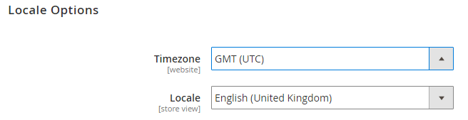
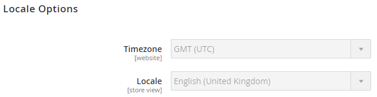

# Beispiel für die Verwaltung systemspezifischer Einstellungen

Dieses Beispiel zeigt, wie Sie die Konfigurationsverwaltung verwenden, um die Speichereinstellungen in allen Umgebungen konsistent zu halten.

Im Beispiel wird das folgende in „Store[Einstellungen“ definierte Verfahren &#x200B;](store-settings.md):

1. Geben Sie Ihre Konfigurationen in den Store-Admin Ihrer Integrationsumgebung ein.
1. Erstellen Sie eine `config.php` Datei und übertragen Sie sie auf Ihre lokale Workstation.
1. Pushen Sie `config.php` in die Remote-Integrationsumgebung.
1. Stellen Sie sicher, dass Ihre Einstellungen in der Admin nicht bearbeitet werden können.
1. Nehmen Sie die erforderlichen Änderungen vor:

   * Ändern Sie die Konfigurationseinstellungen in der Integrationsumgebung.
   * Um Konfigurationen hinzuzufügen, führen Sie den Befehl aus, um `config.php` erneut zu erstellen. Neue Konfigurationen werden an die Datei angehängt.
   * Um vorhandene Konfigurationen zu entfernen oder zu bearbeiten, bearbeiten Sie die Datei manuell.
   * Bestätigen und übertragen.

Beispielsweise können Sie die folgenden Einstellungen festlegen:

* Deaktivieren Sie die Einstellungen für Gebietsschema und statische Dateioptimierung in Ihrer Integrationsumgebung.
* Aktivieren der statischen Dateioptimierung in Staging- und Produktionsumgebungen
* Konfigurieren Sie Fastly in Staging und Produktion mit jeweils spezifischen Anmeldeinformationen.

_Statische Dateioptimierung_ bedeutet das Zusammenführen und Minimieren von JavaScript- und Cascading Style Sheets sowie das Minimieren von HTML-Vorlagen. Siehe [Strategien zur Bereitstellung statischer Inhalte](../deploy/static-content.md).

## Voraussetzungen

Um diese Konfigurationsverwaltungsaufgaben abzuschließen, benötigen Sie Folgendes:

* Rolle des Projektlesers mit Berechtigungen [Umgebung „Admin](../project/user-access.md)
* Admin-URL und Anmeldedaten für Integrations-, Staging- und Produktionsumgebungen

## Konfigurieren von Commerce Admin

In der Integrationsumgebung können Sie sich beim Administrator anmelden, um die Systemkonfigurationseinstellungen für Stores, Websites, Module oder Erweiterungen, die statische Dateioptimierung und die Systemwerte für die statische Inhaltsbereitstellung zu ändern. Siehe [Konfigurationsdaten](store-settings.md#scd-performance).

**So ändern Sie die Einstellungen für Gebietsschema und statische Dateioptimierung**:

1. Melden Sie sich bei der Admin der Integrationsumgebung an. Sie können über die [[!DNL Cloud Console]](../project/overview.md) auf diese URL zugreifen.
1. Navigieren Sie zu **Stores** > Einstellungen > **Konfiguration** > Allgemein **Allgemein**.
1. Erweitern Sie in der Seitennavigation &quot;**&quot;**.
1. Ändern Sie in der **Locale**-Liste das Gebietsschema. Sie können es später wieder ändern.

   

1. Klicken Sie **Konfiguration speichern**.
1. Wenn Sie dazu aufgefordert werden[&#x200B; leeren Sie den Cache](https://experienceleague.adobe.com/de/docs/commerce-admin/systems/tools/cache-management).
1. Melden Sie sich bei der Administratorin bzw. dem Administrator ab.

## Werte exportieren und config.php auf Ihr lokales System übertragen

In diesem Schritt wird die `config.php`-Konfigurationsdatei mithilfe eines Befehls, den Sie auf Ihrem lokalen Computer ausführen, erstellt und in die Integrationsumgebung übertragen.

Dieses Verfahren entspricht Schritt 2 im [empfohlenen Verfahren](store-settings.md). Nachdem Sie `config.php` erstellt haben, übertragen Sie es auf Ihr lokales System, damit Sie es zu Git hinzufügen können.

**So erstellen und übertragen Sie`config.php`**:

1. Wechseln Sie auf Ihrer lokalen Workstation in Ihr Projektverzeichnis.

1. Änderung an der Integrationsumgebung.

   ```bash
   magento-cloud environment:checkout integration
   ```

1. Erstellen Sie einen lokalen Dump der Remote-Datenbank.

   ```bash
   magento-cloud db:dump
   ```

Das folgende Snippet aus `config.php` zeigt ein Beispiel für das Ändern des Standardgebietsschemas in `en_GB` und das Ändern der Einstellungen für die statische Dateioptimierung:

```php?start_inline=1
'general' => [
     'locale' => [
         'code' => 'en_GB',
         'timezone' => 'UTC',
     ],

     ... more ...

 'dev' => [
     'template' => [
         'allow_symlink' => '0',
         'minify_html' => '0',
     ],
     'js' => [
         'merge_files' => '0',
         'enable_js_bundling' => '0',
         'minify_files' => '0',
     ],
     'css' => [
         'merge_css_files' => '0',
         'minify_files' => '0',
     ],

     ... more ...
```

## Pushen und Bereitstellen von config.php in Umgebungen

Nachdem Sie `config.php` erstellt und auf Ihr lokales System übertragen haben, übertragen Sie es auf Git und übertragen Sie es in Ihre Umgebungen. Dieses Verfahren entspricht den Schritten 3 und 4 im [empfohlenen Verfahren](store-settings.md).

Mit dem folgenden Befehl wird die `master`-Verzweigung hinzugefügt, übergeben und per Push übertragen:

```bash
git add app/etc/config.php && git commit -m "Add system-specific configuration" && git push origin master
```

Vollständige Code-Bereitstellung für Staging und Produktion. Zunächst einmal drücken Sie auf `staging` und `master` Verzweigungen. Weitere Informationen zu Bereitstellungsbefehlen finden Sie unter [Store bereitstellen](../deploy/staging-production.md).

Warten Sie, bis die Bereitstellung in allen Umgebungen abgeschlossen ist.

## Überprüfen der Konfigurationsänderungen

Nachdem Sie `config.php` an Ihre Umgebungen gepusht haben, sollten alle von Ihnen geänderten Werte in der Admin schreibgeschützt sein. In diesem Beispiel sollten das geänderte Standardgebietsschema und die geänderten Einstellungen für die statische Dateioptimierung nicht in Admin bearbeitet werden können. Diese Konfigurationseinstellungen werden in `config.php` festgelegt.

So überprüfen Sie Ihre Konfigurationsänderungen:

1. Melden Sie sich in einer der Umgebungen vom Administrator ab.
1. Melden Sie sich wieder beim Administrator an.
1. Klicken Sie auf **Stores** > Einstellungen > **Konfiguration** > Allgemein > **Allgemein**.
1. Erweitern Sie im rechten Bereich **Gebietsschema-Optionen**.

   Beachten Sie, dass mehrere Felder nicht bearbeitet werden können, wie im folgenden Beispiel gezeigt. Diese Konfigurationseinstellungen werden von `config.php` verwaltet.

   

1. Melden Sie sich bei der Administratorin bzw. dem Administrator ab.

## Systemspezifische Konfigurationseinstellungen ändern und aktualisieren

Wenn Sie eine dieser Einstellungen ändern müssen, ändern Sie die `config.php`-Datei manuell mit einem Texteditor. Nachdem Sie die Änderungen oder Entfernungen abgeschlossen haben, können Sie einen Commit ausführen und ihn in die Remote-Umgebung übertragen, indem Sie die vorherigen Schritte ausführen.

Um Konfigurationen hinzuzufügen, ändern Sie Ihre Integrationsumgebung und führen Sie den Befehl erneut aus, um die Datei zu generieren. Alle neuen Konfigurationen werden an den Code in der Datei angehängt. Pushen Sie sie in den vorherigen Schritten an Git.

In diesem Beispiel ändern Sie die statischen Dateioptimierungseinstellungen und fügen eine neue Einstellung für JavaScript hinzu.

### Hinzufügen von Konfigurationen in der Integration

So fügen Sie Konfigurationswerte in der Integrationsumgebung „Admin“ hinzu. In diesem Beispiel werden JavaScript-Dateien zusammengeführt.

1. Melden Sie sich bei der Integrations-Admin ab.
1. Melden Sie sich beim Integrations-Admin wieder an.
1. Klicken Sie auf **Stores** > Einstellungen > **Konfiguration** > **Erweitert** > **Entwickler**.
1. Erweitern Sie im rechten Bereich **JavaScript-Einstellungen**.
1. Klicken Sie in **Liste &quot;JavaScript-** zusammenführen **auf Ja**.
1. Klicken Sie **Konfiguration speichern**.
1. Wenn Sie dazu aufgefordert werden[&#x200B; leeren Sie den Cache](https://experienceleague.adobe.com/de/docs/commerce-admin/systems/tools/cache-management).
1. Melden Sie sich bei der Administratorin bzw. dem Administrator ab.

Wenn Sie den Dump-Befehl erneut ausführen, wird die neue Konfiguration an die Datei angehängt.

```bash
magento-cloud db:dump
```

### Bearbeiten Sie config.php mit neuen Einstellungen

Bearbeiten Sie die aktualisierte `app/etc/config.php`-Datei auf dem lokalen Computer mit einem Texteditor. Bearbeiten Sie diese Einstellungen, um die Minimierung für JavaScript-, HTML- und CSS-Dateien zu aktivieren.

```php?start_inline=1
 'dev' => [
     'template' => [
         'allow_symlink' => '0',
         'minify_html' => '0',
     ],

     ... more ...

     'js' => [
         'merge_files' => '0',
         'enable_js_bundling' => '0',
         'minify_files' => '0',
     ],
     'css' => [
         'merge_css_files' => '0',
         'minify_files' => '0',
     ],
```

Um die Einstellungen so zu ändern, dass die Minimierung möglich ist, bearbeiten Sie `'0'` für `'minify_html'` und jede `'minify_files'` Option auf `'1'` :

```php?start_inline=1
 'dev' => [
     'template' => [
         'allow_symlink' => '0',
         'minify_html' => '1',
     ],

     ... more ...

     'js' => [
         'merge_files' => '0',
         'enable_js_bundling' => '0',
         'minify_files' => '1',
     ],
     'css' => [
         'merge_css_files' => '0',
         'minify_files' => '1',
     ],
```

Speichern Sie die Änderungen in der Datei .

### Übertragen der Änderungen an Git

Geben Sie Folgendes ein, um Ihre Änderungen per Push zu übertragen:

```bash
git add app/etc/config.php
```

```bash
git commit -m "Add system-specific configuration and edit settings"
```

```bash
git push origin master
```

Warten Sie, bis die Bereitstellung abgeschlossen ist.

Wiederholen Sie den Bereitstellungsprozess, um den Code in alle Umgebungen zu pushen.
