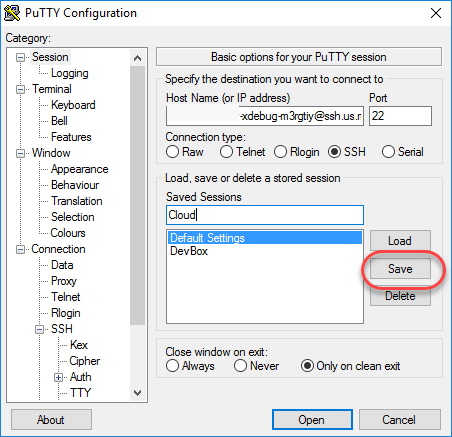

# Konfigurieren von xdebug

[!DNL Xdebug] ist eine Erweiterung zum Debuggen von PHP. Obwohl Sie eine IDE Ihrer Wahl verwenden können, wird im Folgenden beschrieben, wie Sie [!DNL Xdebug] und [!DNL PhpStorm] konfigurieren, um in Ihrer lokalen Umgebung zu debuggen.

>[!NOTE]
>
>Sie können [!DNL Xdebug] so konfigurieren, dass es in der Cloud Docker-Umgebung für das lokale Debugging ausgeführt wird, ohne die Projektkonfiguration für Adobe Commerce in der Cloud-Infrastruktur zu ändern. Siehe [Konfigurieren von Xdebug für Docker](https://developer.adobe.com/commerce/cloud-tools/docker/test/configure-xdebug/).

Um [!DNL Xdebug] zu aktivieren, müssen Sie eine Datei in Ihrem Git-Repository konfigurieren, Ihre IDE konfigurieren und die Port-Weiterleitung einrichten. Einige Einstellungen können in der `magento.app.yaml`-Datei konfiguriert werden. Übertragen Sie die Git-Änderungen nach der Bearbeitung in alle Starter-Umgebungen und Pro-Integrationsumgebungen, um [!DNL Xdebug] zu aktivieren. [!DNL Xdebug] ist bereits in Pro Staging- und Produktionsumgebungen verfügbar.

Nach der Konfiguration können Sie CLI-Befehle, Web-Anfragen und Code debuggen. Beachten Sie, dass alle Cloud-Infrastrukturumgebungen schreibgeschützt sind. Klonen Sie den Code in Ihre lokale Entwicklungsumgebung, um das Debugging durchzuführen. Für Pro-Staging- und Produktionsumgebungen siehe [Zusätzliche Anweisungen](#debug-for-pro-staging-and-production) für [!DNL Xdebug].

## Anforderungen

Um [!DNL Xdebug] auszuführen und zu verwenden, benötigen Sie die SSH-URL für die Umgebung. Sie können die Informationen über die [[!DNL Cloud Console]](../project/overview.md) oder Ihre [!DNL Cloud Onboarding UI] finden.

## Konfigurieren von xdebug

Gehen Sie wie folgt vor, um [!DNL Xdebug] zu konfigurieren:

- [Arbeiten in einer Verzweigung, um Dateiaktualisierungen per Push zu übertragen](#get-started-with-a-branch)
- [Für  [!DNL Xdebug]  aktivieren](#enable-xdebug-in-your-environment)
- [Konfigurieren des PHPStorm-Servers](#configure-phpstorm-server)
- [Einrichten der Port-Weiterleitung](#set-up-port-forwarding)

### Erste Schritte mit einer Verzweigung

Um [!DNL Xdebug] hinzuzufügen, empfiehlt Adobe, in [einer Entwicklungsverzweigung“ ](../dev-tools/cloud-cli-overview.md#create-an-environment-branch) arbeiten.

### Aktivieren von Xdebug in Ihrer Umgebung

Sie können [!DNL Xdebug] direkt für alle Starter-Umgebungen und Pro-Integrationsumgebungen aktivieren. Dieser Konfigurationsschritt ist für Pro-Produktions- und Staging-Umgebungen nicht erforderlich. Siehe [Debugging für Pro-Staging und Produktion](#debug-for-pro-staging-and-production).

>[!VIDEO](https://video.tv.adobe.com/v/3437407?learn=on)

Um [!DNL Xdebug] für Ihr Projekt zu aktivieren, fügen Sie `xdebug` zum Abschnitt `runtime:extensions` der `.magento.app.yaml` hinzu.

**So aktivieren Sie Xdebug**:

1. Öffnen Sie die `.magento.app.yaml`-Datei in einem Texteditor in Ihrem lokalen Terminal.

1. Fügen Sie im `runtime` Abschnitt unter `extensions` `xdebug` hinzu. Beispiel:

   ```yaml
   runtime:
       extensions:
           - redis
           - xsl
           - newrelic
           - sodium
           - xdebug
   ```

1. Speichern Sie Ihre Änderungen in der `.magento.app.yaml` und beenden Sie den Texteditor.

1. Fügen Sie die Änderungen hinzu, übertragen Sie sie und übertragen Sie sie, um die Umgebung erneut bereitzustellen.

   ```bash
   git add .magento.app.yaml
   ```

   ```bash
   git commit -m "add xdebug"
   ```

   ```bash
   git push origin <environment-ID>
   ```

Bei der Bereitstellung in Starter- und Pro-Integrationsumgebungen ist [!DNL Xdebug] jetzt verfügbar. Fahren Sie mit der Konfiguration Ihrer IDE fort. Für PhpStorm siehe [Konfigurieren von PhpStorm](#configure-phpstorm).

### Konfigurieren des PhpStorm-Servers

>[!VIDEO](https://video.tv.adobe.com/v/3437409?learn=on)

Die [PhpStorm](https://www.jetbrains.com/phpstorm/)-IDE muss so konfiguriert sein, dass sie ordnungsgemäß mit [!DNL Xdebug] funktioniert.

**So konfigurieren Sie PhpStorm für Xdebug**:

1. Öffnen Sie in Ihrem PhpStorm-Projekt das Bedienfeld **Einstellungen**.

   - _macOS_—Wählen Sie **PhpStorm** > **Settings**.
   - _Windows/Linux_ - Wählen Sie **Datei** > **Einstellungen**.

1. Erweitern Sie im _Einstellungen_ den Abschnitt **PHP** und klicken Sie auf **Server**.

1. Klicken Sie auf **+**, um eine Server-Konfiguration hinzuzufügen. Der Projektname ist oben grau dargestellt.

1. [Optional] Konfigurieren Sie die folgenden Einstellungen für die neue Server-Konfiguration. Siehe [Kein Debugserver konfiguriert](https://www.jetbrains.com/help/phpstorm/troubleshooting-php-debugging.html#no-debug-server-is-configured) in der Dokumentation _PHPStorm_.

   - **Name** - Geben Sie denselben Host-Namen ein. Dieser Wert muss mit dem Wert für die Variable `PHP_IDE_CONFIG` in [Debug CLI-Befehlen) übereinstimmen, ](#debug-cli-commands) CLI zum Debuggen zu verwenden.
   - **Host** - Geben Sie den Host-Namen ein.
   - **port** - Geben Sie `443` ein.
   - **Debugger** - Wählen Sie `Xdebug` aus.

1. Wählen **Verwenden von Pfadzuordnungen** aus. Im Bereich _Datei/Verzeichnis_ wird der Stamm des Projekts für die `serverName` angezeigt.

1. Klicken Sie in **Spalte „Absoluter Pfad auf dem**&quot; auf das Symbol **Bearbeiten** und fügen Sie eine Einstellung basierend auf der Umgebung hinzu.

   - Für alle Starter-Umgebungen und Pro-Integrationsumgebungen wird der Remote-Pfad `/app`.
   - Für Pro-Staging- und Produktionsumgebungen:

      - Produktion: `/app/<project_code>/`
      - Staging: `/app/<project_code>_stg/`

1. Ändern Sie den [!DNL Xdebug] Port in `9000,9003` oder Sie können ihn im Bedienfeld **PHP** > **Debug** > **Xdebug** > **Debug Port** auf nur `9000` beschränken.

1. Klicken Sie **Apply**.

### Erstellen Sie die PHPStorm Run/Debug-Konfiguration

Dadurch verfügt die Anwendung über die richtigen Debug-Einstellungen, um die Anfrage aus der Adobe Commerce-Anwendung zu verarbeiten.

>[!VIDEO](https://video.tv.adobe.com/v/3437426?learn=on)

1. Öffnen Sie die PHPStorm-Anwendung und klicken Sie oben rechts im Bildschirm auf **[!UICONTROL Add Configuration]** .

1. Klicken Sie auf **[!UICONTROL Add new run configuration]**.

1. Wählen Sie die Option **[!UICONTROL PHP Remote Debug]** aus.

   - Geben Sie einen eindeutigen, aber erkennbaren Namen ein.
   - Aktivieren Sie das Kontrollkästchen [!UICONTROL Filter debug connection by IDE key]**.
   - Wählen Sie den Server aus, den Sie im [vorherigen Abschnitt](#configure-phpstorm-server) erstellt haben. Wenn Sie sie noch nicht erstellt haben, können Sie jetzt eine erstellen. Weitere Informationen finden Sie jedoch in diesem Teil des Einrichtungshandbuchs.
   - Geben Sie im Textfeld **[!UICONTROL IDE key(session id)]** die `PHPSTORM` in Großbuchstaben ein. Wir werden dies auch in anderen Teilen des Setups verwenden. Es ist also wichtig, dies unverändert zu lassen. Wenn Sie eine andere Zeichenfolge auswählen, müssen Sie daran denken, diese an einer anderen Stelle im Einrichtungs- und Konfigurationsprozess zu verwenden.

1. Klicken Sie auf **[!UICONTROL Apply]** > **[!UICONTROL OK]**.

### Einrichten der Port-Weiterleitung

>[!VIDEO](https://video.tv.adobe.com/v/3437410?learn=on)

Ordnen Sie die `XDEBUG` Verbindung vom Server Ihrem lokalen System zu. Um jede Art von Debugging durchzuführen, müssen Sie Port 9000 von Ihrem Adobe Commerce auf dem Cloud-Infrastrukturserver an Ihren lokalen Computer weiterleiten. Siehe einen der folgenden Abschnitte:

- [Port-Weiterleitung auf Mac oder UNIX](#port-forwarding-on-mac-or-unix)
- [Port-Weiterleitung unter Windows](#port-forwarding-on-windows)

#### Port-Weiterleitung auf Mac oder UNIX®

**So richten Sie die Port-Weiterleitung auf einer Mac oder in einer UNIX®-Umgebung ein**:

1. Öffnen Sie ein Terminal.

1. Verwenden Sie SSH, um die Verbindung herzustellen.

   ```bash
   ssh -R 9000:localhost:9000 <ssh url>
   ```

   Verwenden Sie die Option &quot;`-v`&quot; (verbose), damit ein Socket immer dann im Terminal angezeigt wird, wenn er mit dem weiterzuleitenden Port verbunden ist.

   Wenn der Fehler „Verbindung nicht möglich“ oder „Port auf Remote konnte nicht überwacht werden“ angezeigt wird, kann auf dem Server, der Port 9000 belegt, eine weitere aktive SSH-Sitzung bestehen bleiben. Wenn diese Verbindung nicht verwendet wird, können Sie sie beenden.

**Fehlerbehebung bei der Verbindung**:

1. Verwenden Sie SSH, um sich bei der Remote-Integrations-, Staging- oder Produktionsumgebung anzumelden.

1. Liste der SSH-Sitzungen anzeigen: `who`

1. Anzeigen vorhandener SSH-Sitzungen nach Benutzer. Achten Sie darauf, dass Sie keinen anderen Benutzer als sich selbst betreffen!

   - Integration: Benutzernamen ähneln `dd2q5ct7mhgus`
   - Staging: Benutzernamen ähneln `dd2q5ct7mhgus_stg`
   - Produktion: Benutzernamen ähneln `dd2q5ct7mhgus`

1. Suchen Sie für eine Benutzersitzung, die älter als Ihre ist, den Pseudo-Terminal-Wert (PTS), z. B. `pts/0`.

1. Den Prozess-ID (PID), der dem PTS-Wert entspricht, löschen.

   ```bash
   ps aux | grep ssh
   kill <PID>
   ```

   Beispielantwort:

   ```
   dd2q5ct7mhgus        5504  0.0  0.0  82612  3664 ?      S    18:45   0:00 sshd: dd2q5ct7mhgus@pts/0
   ```

   Um die Verbindung zu beenden, geben Sie einen Kill-Befehl mit der Prozess-ID (PID) ein.

   ```bash
   kill 3664
   ```

#### Port-Weiterleitung unter Windows

Um die Port Forwarding (SSH-Tunneling) unter Windows einzurichten, müssen Sie Ihre Windows-Terminalanwendung konfigurieren. In diesem Beispiel wird die Erstellung eines SSH-Tunnels mit &quot;[&quot; ](https://www.chiark.greenend.org.uk/~sgtatham/putty/latest.html). Sie können auch andere Anwendungen wie Cygwin verwenden. Weitere Informationen zu anderen Anwendungen finden Sie in der mit diesen Anwendungen bereitgestellten Anbieterdokumentation.

**So richten Sie einen SSH-Tunnel unter Windows mit Putty ein**:

1. Falls noch nicht geschehen, laden Sie [Putty](https://www.chiark.greenend.org.uk/~sgtatham/putty/latest.html) herunter.

1. Starten Sie Kitt.

1. Klicken Sie im Kategoriebereich auf **Sitzung**.

1. Geben Sie die folgenden Informationen ein:

   - Feld **Hostname (oder IP-Adresse)**: Geben Sie die [SSH-URL](../development/secure-connections.md#connect-to-a-remote-environment) für Ihren Cloud-Server ein
   - **Port** Feld: Enter `22`

   

1. Klicken Sie im Bereich _Kategorie_ auf **Verbindung** > **SSH** > **Tunnel**.

1. Geben Sie die folgenden Informationen ein:

   - Feld für den **Source** Port: `9000` eingeben
   - **Ziel** Feld: `127.0.0.1:9000` eingeben
   - Klicken Sie auf **Remote**

1. Klicken Sie **Hinzufügen**.

   

1. Klicken Sie _Bereich_ Kategorie“ auf **Sitzung**.

1. Geben **im Feld „Gespeicherte**&quot; einen Namen für diesen SSH-Tunnel ein.

1. Klicken Sie **Speichern**.

   

1. Um den SSH-Tunnel zu testen, klicken Sie auf **Laden** und anschließend auf **Öffnen**.

   Wenn der Fehler „Verbindung nicht möglich“ angezeigt wird, überprüfen Sie Folgendes:

   - Alle Putty-Einstellungen sind korrekt
   - Sie führen Putty auf dem Computer aus, auf dem sich Ihre privaten Adobe Commerce on Cloud Infrastructure SSH-Schlüssel befinden

## SSH-Zugriff auf Xdebug-Umgebungen

Zum Initiieren des Debuggens, Ausführen des Setups und mehr benötigen Sie die SSH-Befehle für den Zugriff auf die Umgebungen. Sie können diese Informationen über die [[!DNL Cloud Console]](../development/secure-connections.md#use-an-ssh-command) und Ihre Projekttabelle abrufen.

Für Starter-Umgebungen und Pro-Integrationsumgebungen können Sie den folgenden `magento-cloud` CLI-Befehl verwenden, um SSH in diese Umgebungen zu übertragen:

```bash
magento-cloud environment:ssh --pipe -e <environment-ID>
```

Um [!DNL Xdebug] zu verwenden, führen Sie SSH in der Umgebung wie folgt aus:

```bash
ssh -R <xdebug listen port>:<host>:<xdebug listen port> <SSH-URL>
```

Beispiel:

```bash
ssh -R 9000:localhost:9000 pwga8A0bhuk7o-mybranch@ssh.us.magentosite.cloud
```

## Debugging für Pro-Staging und Produktion

>[!NOTE]
>
>In Pro Staging- und Produktionsumgebungen ist [!DNL Xdebug] immer verfügbar, da diese Umgebungen eine spezielle Einrichtung für [!DNL Xdebug] haben. Alle normalen Webanforderungen werden an einen dedizierten PHP-Prozess weitergeleitet, der keine [!DNL Xdebug] hat. Daher werden diese Anfragen normal verarbeitet und unterliegen nicht der Leistungsbeeinträchtigung, wenn [!DNL Xdebug] geladen wird. Wenn eine Webanforderung gesendet wird, die den [!DNL Xdebug] Schlüssel hat, wird sie an einen separaten PHP-Prozess weitergeleitet, der geladen [!DNL Xdebug].

Um [!DNL Xdebug] speziell für die Pro Plan Staging- und Produktionsumgebung zu verwenden, erstellen Sie einen separaten SSH-Tunnel und eine Websitzung, auf die Sie nur Zugriff haben. Diese Verwendung unterscheidet sich vom typischen Zugriff und bietet nur Ihnen und nicht allen Benutzern Zugriff.

Sie benötigen Folgendes:

- SSH-Befehle für den Zugriff auf die Umgebungen. Sie können diese Informationen über die [[!DNL Cloud Console]](../project/overview.md) oder Ihre [!DNL Cloud Onboarding UI] erhalten.
- Der `xdebug_key` Wert, der bei der Konfiguration der Staging- und Pro-Umgebungen festgelegt wird.

  Die `xdebug_key` finden Sie, indem Sie SSH verwenden, um sich beim primären Knoten anzumelden, und Folgendes ausführen:

  ```bash
  cat /etc/platform/*/nginx.conf | grep xdebug.sock | head -n1
  ```

**So richten Sie einen SSH-Tunnel in eine Staging- oder Produktionsumgebung ein**:

1. Öffnen Sie ein Terminal.

1. Bereinigen Sie alle SSH-Sitzungen für jeden Web-Knoten des Clusters.

   ```bash
   ssh USERNAME@CLUSTER.ent.magento.cloud 'rm /run/platform/USERNAME/xdebug.sock'
   ```

1. Richten Sie den SSH-Tunnel für Xdebug für jeden Web-Knoten des Clusters ein.

   ```bash
   ssh -R /run/platform/USERNAME/xdebug.sock:localhost:9000 -N USERNAME@CLUSTER.ent.magento.cloud
   ```

>[!NOTE]
>
>So rufen Sie den richtigen Wert für `USERNAME@CLUSTER.ent.magento.cloud` ab:
>- Methode 1: Magento-Cloud-CLI: `magento-cloud ssh --all`
>- Methode 2: Commerce-Konsole: https://CONSOLE-URL/ENVIRONMENT, klicken Sie auf das `SSH v` Dropdown-Menü

**So starten Sie das Debugging mit der Umgebungs-URL**:

Dies ist eine Demonstration der verwendeten Konfigurationen sowie eine Demonstration des GET-Parameters zum Starten einer Remote-Debugging-Sitzung.

>[!VIDEO](https://video.tv.adobe.com/v/3437417?learn=on)

1. Remote-Debugging aktivieren; besuchen Sie die Website im Browser und fügen Sie Folgendes an die URL an, wobei `KEY` Wert für `xdebug_key` ist.

   ```http
   ?XDEBUG_SESSION_START=KEY
   ```

   In diesem Schritt wird das Cookie gesetzt, das Browser-Anfragen an Trigger [!DNL Xdebug] sendet.

1. Schließen Sie das Debugging mit [!DNL Xdebug] ab.

1. Wenn Sie bereit sind, die Sitzung zu beenden, verwenden Sie den folgenden Befehl, um das Cookie zu entfernen und das Debugging über den Browser zu beenden, wobei `KEY` Wert für `xdebug_key` ist.

   ```http
   ?XDEBUG_SESSION_STOP=KEY
   ```

   >[!NOTE]
   >
   >Die von `POST` Anforderungen übergebenen `XDEBUG_SESSION_START` werden nicht unterstützt.

## Debuggen von CLI-Befehlen

Dieser Abschnitt führt Sie durch das Debugging von CLI-Befehlen.

So debuggen Sie CLI-Befehle:

1. SSH in den Server, den Sie mit CLI-Befehlen debuggen möchten.

1. Erstellen Sie die folgenden Umgebungsvariablen:

   ```bash
   export XDEBUG_CONFIG='PHPSTORM'
   ```

   ```bash
   export PHP_IDE_CONFIG="serverName=<name of the server that is configured in PHPSTORM>"
   ```

   Diese Variablen werden entfernt, wenn die SSH-Sitzung beendet wird.

1. Starten des Debuggens

   Führen Sie in Starter- und Pro-Integrationsumgebungen den CLI-Befehl zum Debugging aus.
Sie können Laufzeitoptionen hinzufügen, z. B.:

   ```bash
   php -d xdebug.profiler_enable=On -d xdebug.max_nesting_level=9999 bin/magento cache:clean
   ```

   In Pro Staging- und Produktionsumgebungen müssen Sie beim Debuggen von CLI-Befehlen den Pfad zur [!DNL Xdebug] PHP-Konfigurationsdatei angeben, z. B.:

   ```bash
   php -c /etc/platform/USERNAME/php.xdebug.ini bin/magento cache:clean
   ```

## Debuggen von Web-Anfragen

Mit den folgenden Schritten können Sie Web-Anfragen debuggen.

1. Klicken Sie im Menü _Erweiterung_ auf **Debuggen**, um zu aktivieren.

1. Klicken Sie mit der rechten Maustaste, wählen Sie das Optionsmenü aus und legen Sie die IDE-Taste auf **PHPSTORM** fest.

1. Installieren Sie den [!DNL Xdebug] Client im Browser. Konfigurieren und aktivieren Sie sie.

### Beispiel: Chrome-Setup

In diesem Abschnitt wird die Verwendung von [!DNL Xdebug] in Chrome mithilfe der [!DNL Xdebug] Helper-Erweiterung beschrieben. Informationen zu [!DNL Xdebug]-Tools für andere Browser finden Sie in der Browser-Dokumentation.

**Verwenden von Xdebug Helper mit Chrome**:

1. Erstellen Sie einen [SSH-](#ssh-access-to-xdebug-environments)) zum Cloud-Server.

1. Installieren Sie die [Xdebug Helper](https://chromewebstore.google.com/detail/eadndfjplgieldjbigjakmdgkmoaaaoc)-Erweiterung über den Chrome-Store.

1. Aktivieren Sie die Erweiterung in Chrome, wie in der folgenden Abbildung dargestellt.

   

1. Klicken Sie in Chrome mit der rechten Maustaste auf das grüne Hilfesymbol in der Chrome-Symbolleiste.

1. Klicken Sie im Popup-Menü auf **Optionen**.

1. Klicken Sie in der _IDE-_ Liste auf **PhpStorm**.

1. Klicken Sie **Speichern**.

   

1. Öffnen Sie Ihr PhpStorm-Projekt.

1. Klicken Sie in der oberen Navigationsleiste auf das Symbol **Hören starten**.

   Wenn die Navigationsleiste nicht angezeigt wird, klicken Sie auf **Ansicht** > **Navigationsleiste**.

1. Doppelklicken Sie im Navigationsbereich von PhpStorm auf die zu testende PHP-Datei.

## Debuggen von lokalem Code

Aufgrund der schreibgeschützten Umgebungen müssen Sie Code aus einer Umgebung oder einer bestimmten Git-Verzweigung auf die lokale Workstation ziehen, um ein Debugging durchzuführen.

Die Methode, die Sie wählen, liegt bei Ihnen. Sie haben die folgenden Optionen:

- Checken Sie Code aus Git aus und führen Sie `composer install` aus

  Diese Methode funktioniert nur, wenn `composer.json` auf Pakete in privaten Repositorys verweist, auf die Sie keinen Zugriff haben. Mit dieser Methode wird die gesamte Adobe Commerce-Codebasis abgerufen.

- Kopieren Sie die Ordner `vendor`, `app`, `pub`, `lib` und `setup`

  Diese Methode führt dazu, dass Sie den gesamten Code haben, den Sie möglicherweise testen können. Je nachdem, wie viele statische Assets Sie haben, kann dies zu einer langen Übertragung mit einer großen Anzahl von Dateien führen.

- Nur das `vendor` kopieren

  Da sich der größte Teil des Codes im `vendor` Verzeichnis befindet, führt diese Methode wahrscheinlich zu guten Tests, testet jedoch nicht die gesamte Codebasis.

**So komprimieren Sie Dateien und kopieren sie auf Ihren lokalen Computer**:

1. Verwenden Sie SSH, um sich bei der Remote-Umgebung anzumelden.

1. Komprimieren Sie die Dateien.

   ```bash
   tar -czf /tmp/<file-name>.tgz <directory list>
   ```

   So komprimieren Sie beispielsweise nur das `vendor`:

   ```bash
   tar -czf /tmp/vendor.tgz vendor
   ```

1. Verwenden Sie in Ihrer lokalen Umgebung PhpStorm, um die Dateien zu komprimieren.

   ```bash
   cd <phpstorm project root dir>
   ```

   ```bash
   rsync <SSH-URL>:/tmp/<file-name>.tgz .
   ```

   ```bash
   tar xzf <file-name>.tgz
   ```
