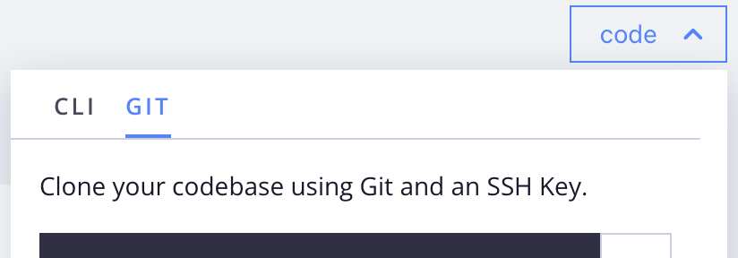

# Vorbereiten der Entwicklung

Unabhängig davon, ob Sie neu bei Commerce sind oder bereits Inhaber von Commerce sind und zur Cloud-Infrastruktur wechseln, können Sie mit diesen Schritten einen Entwicklungsarbeitsbereich für Ihr Cloud-Projekt vorbereiten. Wenn Sie bereits einige dieser Schritte abgeschlossen haben oder bereits über eine Adobe Commerce-Entwicklungsumgebung verfügen, sehen Sie sich die folgenden Schritte an, um die erwarteten Ergebnisse anzuzeigen, und fahren Sie mit dem nächsten Schritt fort. Einige Konfigurationen und Workflows unterscheiden sich von einer typischen On-Premise-Installation.

## Anmeldeinformationen

Bevor Sie einen Arbeitsbereich einrichten, stellen Sie die folgenden Schlüssel und Kontozugriff bereit:

- **Authentifizierungsschlüssel (Composer-Schlüssel)**

  Authentifizierungsschlüssel sind 32-stellige Authentifizierungs-Token, die sicheren Zugriff auf das Adobe Commerce Composer Repository (`repo.magento.com`) und alle anderen Git-Services bieten, die für die Anwendungsentwicklung erforderlich sind, z. B. GitHub. Ihr Konto kann über mehrere Authentifizierungsschlüssel verfügen. Beginnen Sie bei der Einrichtung des Arbeitsbereichs mit einem bestimmten Schlüssel für Ihr Code-Repository. Wenn Sie keine Schlüssel haben, wenden Sie sich an den Projektbesitzer oder erstellen Sie die [Authentifizierungsschlüssel](../cloud-guide/development/authentication-keys.md) selbst.

- **Cloud-Projektkonto**

  Der Projektbesitzer sollte Sie zum Adobe Commerce on Cloud-Infrastrukturprojekt einladen. Wenn Sie die E-Mail-Einladung erhalten, klicken Sie auf den Link und folgen Sie den Anweisungen, um Ihr Konto zu erstellen. Siehe [Onboarding](onboarding.md)

- **Adobe Commerce-Verschlüsselungsschlüssel**

  Wenn Sie nur ein vorhandenes System importieren, erfassen Sie den Verschlüsselungsschlüssel, der zum Schutz Ihres Zugriffs und Ihrer Daten für die Datenbank verwendet wird. Weitere Informationen zu diesem Schlüssel finden Sie unter [Beheben von Problemen mit dem Verschlüsselungsschlüssel](https://experienceleague.adobe.com/docs/commerce-knowledge-base/kb/troubleshooting/miscellaneous/resolve-issues-with-encryption-key.html)

## Entwickler-Tools

- **Installieren der Cloud-CLI**

  Installieren Sie die `magento-cloud` CLI, damit Sie Cloud-Umgebungen verwalten und Automatisierungsaufgaben ausführen können. Siehe [Cloud-CLI](../cloud-guide/dev-tools/cloud-cli-overview.md) für Installationsanweisungen.

- **Installieren von Docker für lokale Entwicklung und Tests**

  Optional können Sie die Docker-Umgebung verwenden, um die Commerce in der Cloud-Infrastruktur `integration` -Umgebung für die lokale Entwicklung zu emulieren. Es gibt drei wesentliche Komponenten: eine Adobe Commerce v2-Vorlage, Docker Compose und `ece-tools`.

   - [Docker-Architektur und allgemeine Befehle](../cloud-guide/dev-tools/cloud-docker.md)
   - [Docker-Entwicklungsumgebung starten](https://developer.adobe.com/commerce/cloud-tools/docker/setup/)
   - [ECE-Tools-Paket](../cloud-guide/dev-tools/package-overview.md)

- **Integrieren von Git-basierten Services**

  Integrieren Sie optional einen Git-basierten Hosting-Service wie GitHub oder GitLab mit Adobe Commerce in der Cloud-Infrastruktur. Siehe [Integrationen](../cloud-guide/integrations/overview.md).

## Projekt-Code

Eine sichere Verbindung ist für die Interaktion mit den Remote-Umgebungen unerlässlich. Melden Sie sich bei einem [&#x200B; Projekt bei an  [!DNL Cloud Console]](https://console.adobecommerce.com) klicken Sie auf **[!UICONTROL No SSH key]**. Dieses Symbol befindet sich rechts neben dem Befehlsfeld und ist sichtbar, wenn das Projekt keinen SSH-Schlüssel enthält. Siehe [Sichere Verbindungen](../cloud-guide/development/secure-connections.md#add-an-ssh-public-key-to-your-account)

**So klonen Sie Ihre Codebasis auf Ihrer lokalen Workstation**:

1. Klicken Sie in der [[!DNL Cloud Console]](https://console.adobecommerce.com) auf **[!UICONTROL code]** und wählen Sie die Registerkarte **[!UICONTROL Git]** aus.

   {width="450"}

1. Kopieren Sie den angegebenen `git clone ...`.

1. Erstellen Sie in einem Terminal Ihr Arbeitsverzeichnis und ändern Sie es.

1. Fügen Sie den `git clone ...` ein und führen Sie ihn aus.

>[!TIP]
>
>Adobe stellt Ihre anfängliche Projektumgebung mithilfe eines Vorlagen-Repositorys bereit, das Paketanweisungen für eine bestimmte Version von Adobe Commerce enthält. Lesen Sie das Thema [Projektdateistruktur](../cloud-guide/project/file-structure.md) und erfahren Sie mehr über wichtige Projektdateien und Cloud-Vorlagen.
